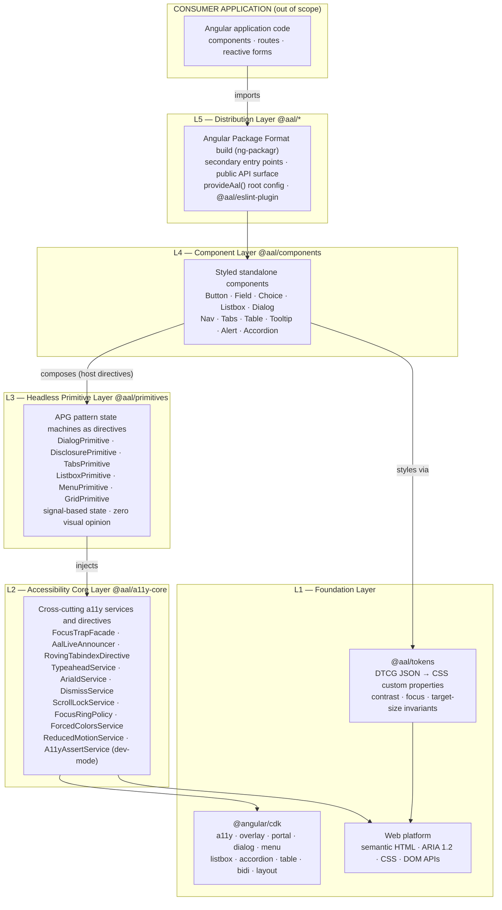
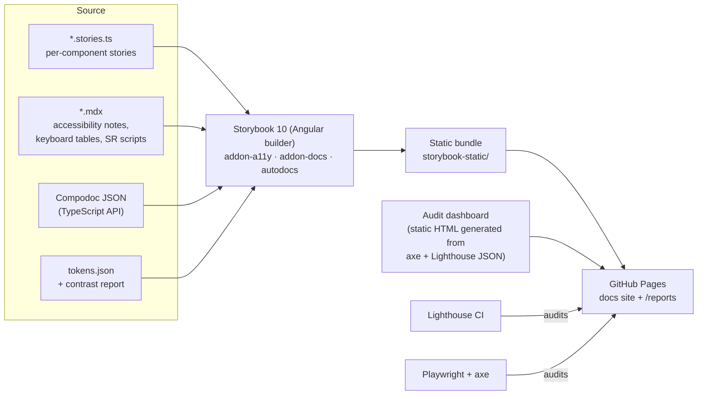
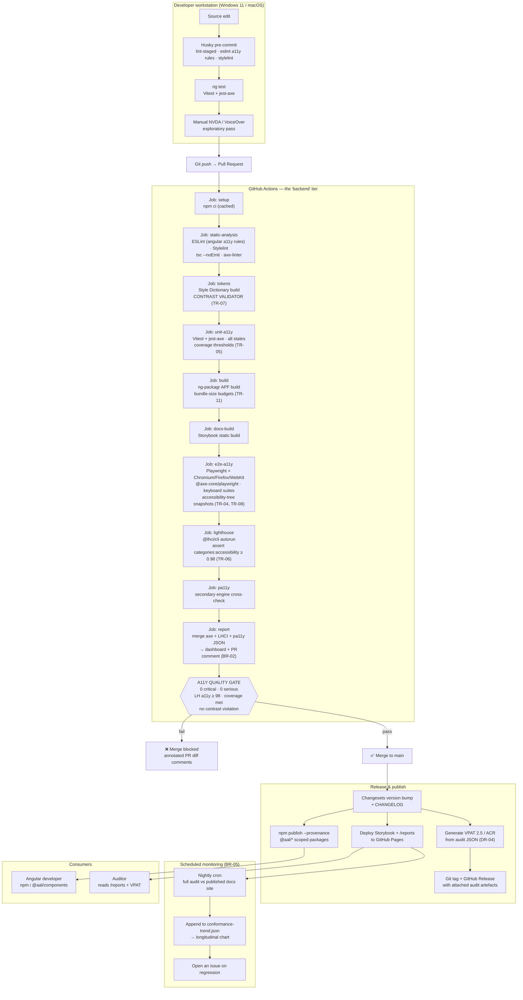
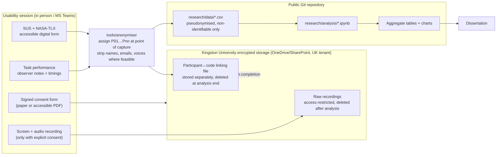
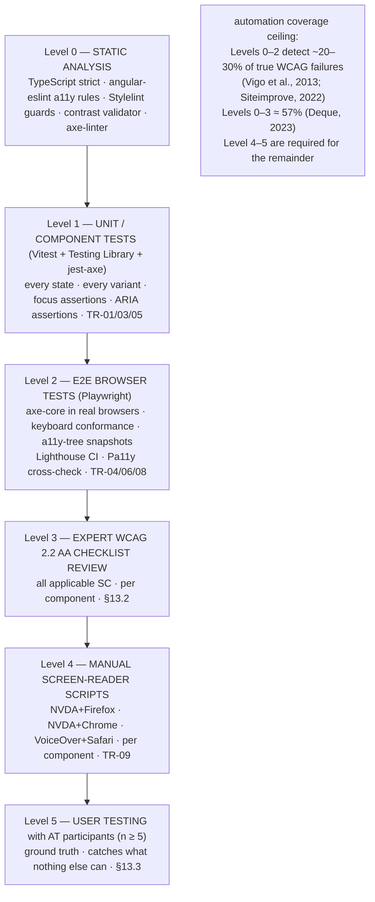

# Product Requirements Document (PRD)
## Angular Aria Library (AAL) — An Accessibility-First UI Component Library for Angular

---

| Field | Value |
|---|---|
| **Product name** | Angular Aria Library (AAL) |
| **npm scope** | `@aal/*` |
| **Document version** | 1.0 |
| **Status** | Approved for implementation |
| **Author** | M R A Rasheed (K2635673) |
| **Course** | MSc Software Engineering, Kingston University London |
| **Supervisor** | Ms. Karishani Bamunawita |
| **Parent document** | `Research_Proposal_Rasheed.md` (May 2026) |
| **Implementation window** | August 2026 – November 2026 |
| **Target conformance** | WCAG 2.2 Level AA + WAI-ARIA Authoring Practices Guide (APG) 1.2 |
| **Runtime backend** | **None** — see §8 for the rationale and the build/delivery architecture that replaces it |

---

## Table of Contents

1. [Overview and Purpose](#1-overview-and-purpose)
2. [Problem Statement, Goals and Non-Goals](#2-problem-statement-goals-and-non-goals)
3. [Personas and User Stories](#3-personas-and-user-stories)
4. [Scope — Component Inventory](#4-scope--component-inventory)
5. [Requirements Catalogue](#5-requirements-catalogue)
6. [Technology Stack](#6-technology-stack)
7. [Frontend Architecture](#7-frontend-architecture)
8. [Backend Architecture — Why There Is No Runtime Server](#8-backend-architecture--why-there-is-no-runtime-server)
9. [Component Specifications](#9-component-specifications)
10. [Design Token and Theming Specification](#10-design-token-and-theming-specification)
11. [Testing and Quality Strategy](#11-testing-and-quality-strategy)
12. [CI/CD Pipeline Specification](#12-cicd-pipeline-specification)
13. [Evaluation and Research Instrumentation](#13-evaluation-and-research-instrumentation)
14. [Non-Functional Requirements](#14-non-functional-requirements)
15. [Documentation and Developer Experience](#15-documentation-and-developer-experience)
16. [Delivery Roadmap and Definition of Done](#16-delivery-roadmap-and-definition-of-done)
17. [Risks and Mitigations](#17-risks-and-mitigations)
18. [Success Metrics and Acceptance Criteria](#18-success-metrics-and-acceptance-criteria)
19. [Deviations and Corrections from the Research Proposal](#19-deviations-and-corrections-from-the-research-proposal)
20. [Appendices](#20-appendices)

---

## 1. Overview and Purpose

### 1.1 What this document is

This PRD translates the approved research proposal *"Accessible Web UI Component Library: Design, Implementation, and Evaluation in Angular"* into an executable engineering specification. Where the proposal states **what** will be researched and **why**, this document states **what will be built**, **with which technologies**, **in what architecture**, and **against which measurable acceptance criteria**.

Every requirement in this document is traceable to one of the seven research objectives in §2.2 of the proposal. The traceability matrix is in [Appendix A](#appendix-a--requirements-to-objectives-traceability).

### 1.2 Product summary

AAL is an **open-source, MIT-licensed, npm-distributed Angular component library** in which WCAG 2.2 Level AA conformance is an enforced structural property of the components rather than a documented aspiration. A developer who installs AAL and uses its components as documented obtains an accessible interface **by default**, with no post-hoc remediation, no manual ARIA authoring, and no accessibility expertise required.

The library is deliberately architected in two consumable tiers:

- **Headless tier** (`@aal/primitives`) — unstyled behaviour: ARIA state machines, focus management, keyboard interaction models. Consumers bring their own visual design.
- **Styled tier** (`@aal/components`) — the headless tier plus a token-driven default theme whose colour contrast, focus indication and target sizes are WCAG-conformant invariants that consumer overrides cannot break.

This two-tier split is itself a research contribution: it is the architectural pattern that made React Aria and Radix UI viable, and it has no Angular equivalent.

### 1.3 What "accessibility-first" means operationally

The term is defined here in falsifiable, testable terms so that the dissertation can defend it:

| Principle | Operational definition | Enforcement mechanism |
|---|---|---|
| **Correct by construction** | The accessible behaviour is the only behaviour; there is no "accessible mode" to opt into. | Component API design; no ARIA attribute is a consumer responsibility. |
| **Impossible to misuse silently** | A consumer misconfiguration that would break accessibility fails loudly. | Dev-mode runtime assertions, TypeScript discriminated unions, ESLint rules shipped with the package. |
| **Non-overridable invariants** | Focus indicators, contrast ratios and target sizes cannot be removed by consumer CSS. | Token architecture with sealed private tokens (§10.4); Stylelint guard rules. |
| **Continuously verified** | Conformance is re-proved on every commit, not asserted once. | CI accessibility gates (§12) — a build fails on any serious/critical violation. |
| **Empirically validated** | Conformance claims are tested against real assistive-technology users, not only scanners. | Evaluation programme (§13). |

### 1.4 Intended audience for this PRD

The MSc candidate (as sole implementer), the academic supervisor, the second marker, and any future open-source contributor to the AAL repository.

---

## 2. Problem Statement, Goals and Non-Goals

### 2.1 Problem statement

Mainstream Angular component libraries — Angular Material, PrimeNG, NG-ZORRO — supply *partial* accessibility: some ARIA attributes, some keyboard handlers, and documentation that explicitly transfers final responsibility to the consuming developer. The consequence is that WCAG conformance requires expertise and effort that most teams do not have, and 95.9% of the top one million homepages still contain automatically detectable WCAG A/AA failures (WebAIM, 2026).

The React ecosystem solved this structurally with accessibility-first primitive libraries (Radix UI, React Aria, Fluent UI). **Angular has no equivalent.** That absence is the gap this product fills.

### 2.2 Product goals

| ID | Goal | Measured by |
|---|---|---|
| **G1** | Ship an Angular component library with zero serious/critical axe-core violations across all components and all documented states. | Automated CI gate (§12.3) |
| **G2** | Achieve full conformance to every WCAG 2.2 Level AA success criterion applicable at component scope. | Expert checklist review (§13.2) |
| **G3** | Implement every interactive component against its WAI-ARIA APG 1.2 pattern, including the full keyboard interaction model. | Per-component spec tables (§9); keyboard conformance tests |
| **G4** | Prove that the library is usable by real assistive-technology users, not merely scanner-clean. | Usability study, ≥5 AT participants (§13.3) |
| **G5** | Demonstrate a measurable reduction in developer effort versus Angular Material for building accessible UI. | Controlled developer-effort study (§13.4) |
| **G6** | Make accessibility regressions impossible to merge undetected. | CI pipeline blocking on a11y gates |
| **G7** | Publish the library, its documentation, its audit reports and its evaluation instruments as reusable open-source artefacts. | npm + GitHub Pages + repository |

### 2.3 Non-goals (explicitly out of scope)

Fixing scope is a stated risk mitigation in the proposal (§7, Risk Assessment). The following are **out of scope for the MSc deliverable** and must not be added mid-project:

| ID | Non-goal | Rationale |
|---|---|---|
| **NG1** | A .NET Blazor parallel implementation. | Descoped between the Project Definition and the approved Research Proposal to keep the implementation focused. |
| **NG2** | Any runtime backend server, database, or authenticated API. | See §8.1. The product is a client-side library; a server would add scope without serving any research objective. |
| **NG3** | WCAG 2.2 Level AAA conformance. | AA is the legally referenced level (PSBAR 2018, EAA 2019). AAA criteria are documented where met but not required. |
| **NG4** | A full design system (illustration, brand, motion language, iconography set). | Only the tokens required to make accessibility invariants enforceable are in scope. |
| **NG5** | Charting, rich-text editing, date-picker, file-upload, drag-and-drop reordering, virtualised infinite scroll. | High complexity, low incremental research value. Listed as future work. |
| **NG6** | Internet Explorer 11 or any non-evergreen browser support. | Out of support; distorts the implementation toward legacy workarounds. |
| **NG7** | Native mobile (Ionic/NativeScript) component variants. | Web platform only; TalkBack testing is limited to mobile web. |
| **NG8** | Automated remediation of a consumer's existing codebase (codemods, linter-as-a-service). | Separate product category. |

### 2.4 Assumptions

- **A1** — Kingston University Research Ethics Committee approval is obtained before any participant recruitment (application submitted June 2026).
- **A2** — A Windows machine (NVDA) and macOS access (VoiceOver) are available for screen-reader testing.
- **A3** — The GitHub repository is public, granting free GitHub Actions minutes and free GitHub Pages hosting.
- **A4** — At least five assistive-technology users can be recruited via university disability services or accessibility community networks.
- **A5** — No commercial licence spend is required; every tool in §6 is free or free for open-source use.

---

## 3. Personas and User Stories

### 3.1 Personas

| ID | Persona | Description | Primary need |
|---|---|---|---|
| **P1** | **Priya — Angular application developer** | 4 years Angular, enterprise line-of-business apps. No formal accessibility training. Has heard of WCAG; has never read it. | Install a component and have it be accessible without learning ARIA. |
| **P2** | **Marcus — Accessibility specialist / auditor** | Audits public-sector applications against WCAG 2.2 AA. Uses axe DevTools, NVDA, JAWS. | Verify conformance claims quickly, from evidence rather than marketing. |
| **P3** | **Aisha — Screen-reader user (end user)** | Blind; NVDA + Firefox daily driver; expert browse/focus-mode user. | Predictable announcements, no inescapable focus traps, correct role/state semantics. |
| **P4** | **Tom — Keyboard-only user (end user)** | Motor impairment; no mouse; uses keyboard and switch access. | Every control reachable and operable by keyboard, with an always-visible focus indicator. |
| **P5** | **Dr. Chen — Research supervisor / examiner** | Assesses methodological rigour and evidential quality. | Reproducible evidence linking every claim to a measurement. |
| **P6** | **Sam — Open-source contributor** | Wants to add a component after the dissertation. | A documented contribution path with automated a11y gates. |

### 3.2 User stories

Stories are the source of the sprint backlog; each is delivered with acceptance criteria in the repository issue tracker.

**Priya (developer)**

| ID | Story |
|---|---|
| US-01 | As Priya, I want to install one package and import a standalone component, so that I do not have to configure NgModules. |
| US-02 | As Priya, I want a modal dialog that traps focus, closes on `Escape` and restores focus to the trigger with no configuration, so that I cannot get it wrong. |
| US-03 | As Priya, I want a form field that automatically associates label, hint and error text with the input, so that I never ship an unlabelled input. |
| US-04 | As Priya, I want a dev-mode console error when I omit an accessible name, so that the mistake is caught before code review. |
| US-05 | As Priya, I want to theme components with CSS custom properties, so that I can match my brand without `::ng-deep` overrides. |
| US-06 | As Priya, I want tree-shakeable secondary entry points, so that unused components never enter my bundle. |

**Marcus (auditor)**

| ID | Story |
|---|---|
| US-07 | As Marcus, I want each component's documentation to list its ARIA role, states, keyboard model and satisfied WCAG SC, so that I can audit by inspection. |
| US-08 | As Marcus, I want machine-readable axe-core reports published per release, so that I can verify the conformance claim independently. |
| US-09 | As Marcus, I want a VPAT 2.5 / Accessibility Conformance Report, so that I can include the library in procurement documentation. |

**Aisha (screen-reader user)**

| ID | Story |
|---|---|
| US-10 | As Aisha, I want dialog opening to move focus into the dialog and announce its accessible name, so that I know where I am. |
| US-11 | As Aisha, I want asynchronous status changes announced politely without stealing focus, so that my reading position is preserved. |
| US-12 | As Aisha, I want row and column headers announced as I navigate table cells, so that I can interpret the data. |
| US-13 | As Aisha, I want error messages programmatically associated with their field, so that I hear the error when I reach the field. |

**Tom (keyboard user)**

| ID | Story |
|---|---|
| US-14 | As Tom, I want a skip link as the first focusable element, so that I can bypass repeated navigation. |
| US-15 | As Tom, I want a focus indicator with ≥3:1 contrast that is never clipped or obscured, so that I always know where focus is. |
| US-16 | As Tom, I want composite widgets to expose a single tab stop with arrow-key navigation, so that tabbing through a page is not exhausting. |
| US-17 | As Tom, I want all interactive targets to be at least 24×24 CSS pixels, so that activation is reliable. |

**Dr. Chen / Sam**

| ID | Story |
|---|---|
| US-18 | As Dr. Chen, I want every conformance claim to link to a dated, reproducible artefact. |
| US-19 | As Sam, I want a new component to be blocked from merge unless it passes the same a11y gates as the existing set. |

---

## 4. Scope — Component Inventory

### 4.1 Prioritisation (MoSCoW)

The proposal fixes the evaluated scope at **eight core components**. Those eight are **MUST** and form the evaluation population; SHOULD/COULD components are shipped but excluded from the formal usability study to protect the timeline.

| # | Component | Entry point | APG pattern | Priority | Sprint | In formal evaluation |
|---|---|---|---|---|---|---|
| 1 | **Button** | `@aal/components/button` | Button | **MUST** | 1 | Yes |
| 2 | **Text Field** (input + textarea) | `@aal/components/field` | — (native + labelling) | **MUST** | 2 | Yes |
| 3 | **Checkbox / Radio Group** | `@aal/components/choice` | Checkbox, Radio Group | **MUST** | 2 | Yes |
| 4 | **Select / Listbox** | `@aal/components/listbox` | Listbox | **MUST** | 2 | Yes |
| 5 | **Dialog (Modal)** | `@aal/components/dialog` | Dialog (Modal) | **MUST** | 3 | Yes |
| 6 | **Navigation Menu** | `@aal/components/nav` | Disclosure Navigation Menu | **MUST** | 4 | Yes |
| 7 | **Tabs** | `@aal/components/tabs` | Tabs | **MUST** | 4 | Yes |
| 8 | **Data Table** | `@aal/components/table` | Table / Grid | **MUST** | 5 | Yes |
| 9 | Link | `@aal/components/link` | — | SHOULD | 1 | No |
| 10 | Skip Link | `@aal/components/skip-link` | — (SC 2.4.1) | SHOULD | 1 | No |
| 11 | Visually Hidden | `@aal/components/visually-hidden` | — | SHOULD | 1 | No |
| 12 | Switch | `@aal/components/choice` | Switch | SHOULD | 2 | No |
| 13 | Tooltip | `@aal/components/tooltip` | Tooltip | SHOULD | 3 | No |
| 14 | Disclosure / Popover | `@aal/components/disclosure` | Disclosure | SHOULD | 3 | No |
| 15 | Alert / Toast | `@aal/components/alert` | Alert | SHOULD | 3 | No |
| 16 | Menu Button | `@aal/components/menu` | Menu Button | SHOULD | 4 | No |
| 17 | Breadcrumb | `@aal/components/breadcrumb` | Breadcrumb | SHOULD | 4 | No |
| 18 | Pagination | `@aal/components/pagination` | — | COULD | 4 | No |
| 19 | Accordion | `@aal/components/accordion` | Accordion | SHOULD | 5 | No |
| 20 | Combobox (autocomplete) | `@aal/components/combobox` | Combobox | COULD | 5 (stretch) | No |

### 4.2 Scope-change control

Adding a component after Sprint 2 begins requires a supervisor-approved scope change recorded as an ADR in `docs/decisions/`. This operationalises the proposal's scope-creep mitigation.

---

## 5. Requirements Catalogue

Requirement IDs are stable and are referenced by tests, commit messages and the dissertation.
Prefixes: **FR** functional · **AR** accessibility · **NFR** non-functional · **TR** testing · **DR** documentation · **RR** research/evaluation · **BR** build & delivery.

### 5.1 Functional requirements

| ID | Requirement | Priority |
|---|---|---|
| FR-01 | All components SHALL be Angular **standalone** components/directives requiring no NgModule import. | MUST |
| FR-02 | All components SHALL be published in the Angular Package Format with **secondary entry points** per component, so unused components are tree-shaken. | MUST |
| FR-03 | A **headless tier** (`@aal/primitives`) SHALL expose each interaction pattern as unstyled directives with no visual opinion. | MUST |
| FR-04 | A **styled tier** (`@aal/components`) SHALL compose the headless tier with the default token theme. | MUST |
| FR-05 | All form-input components SHALL implement `ControlValueAccessor` and integrate with Reactive and template-driven forms, including `Validators`, `touched`/`dirty` state and `setDisabledState`. | MUST |
| FR-06 | Component inputs/outputs SHALL use Angular signal APIs (`input()`, `output()`, `model()`) with strict typing. | MUST |
| FR-07 | Every component SHALL generate deterministic, collision-free element IDs for ARIA relationships (`aria-labelledby`, `aria-describedby`, `aria-controls`) without consumer-supplied IDs. | MUST |
| FR-08 | Every component SHALL accept an accessible name through a typed API and SHALL raise a **dev-mode error** when no accessible name can be resolved for a component that requires one. | MUST |
| FR-09 | Components SHALL be **SSR-safe**: no direct `window`/`document` access outside `afterNextRender`/`DOCUMENT` injection; hydration-stable markup. | MUST |
| FR-10 | Components SHALL function under **zoneless change detection** as well as with Zone.js. | MUST |
| FR-11 | The library SHALL provide `provideAal({...})` for global configuration: announcement locale strings, focus-ring policy, reduced-motion policy, dev-assertion level. | MUST |
| FR-12 | All library-emitted strings SHALL be localisable, defaulting to English (en-GB). | MUST |
| FR-13 | Components SHALL support RTL via CDK `Directionality`, including arrow-key direction inversion in composite widgets. | SHOULD |
| FR-14 | The library SHALL ship `@aal/eslint-plugin` with rules detecting misuse of AAL components in consumer code. | SHOULD |
| FR-15 | The library SHALL expose a public `AalLiveAnnouncer` facade for consumer announcements consistent with library behaviour. | SHOULD |

### 5.2 Accessibility requirements (normative)

These are the requirements the research evaluates.

| ID | Requirement | WCAG 2.2 SC | Level |
|---|---|---|---|
| AR-01 | Every component SHALL be built on the most semantically appropriate native HTML element; ARIA SHALL be used only where no native element exists. | 1.3.1, 4.1.2 | A |
| AR-02 | Every interactive element SHALL be fully operable by keyboard alone, with no keyboard trap other than intentional, escapable modal focus traps. | 2.1.1, 2.1.2 | A |
| AR-03 | Every interactive component SHALL implement the keyboard interaction model of its WAI-ARIA APG 1.2 pattern, verbatim. | 2.1.1, 4.1.2 | A |
| AR-04 | Focus order SHALL be meaningful and DOM-consistent; composite widgets SHALL expose exactly one tab stop, using roving `tabindex` or `aria-activedescendant` internally. | 2.4.3 | A |
| AR-05 | A visible focus indicator SHALL be present on every focusable element, with ≥3:1 contrast against adjacent colours and ≥2 CSS px perimeter thickness. | 2.4.7, 1.4.11 | AA |
| AR-06 | The focused element SHALL NOT be entirely hidden by author-created content (sticky headers, overlays). | **2.4.11 Focus Not Obscured (Minimum)** | AA |
| AR-07 | All text SHALL meet 4.5:1 contrast (3:1 for large text) in every shipped theme. | 1.4.3 | AA |
| AR-08 | All UI component boundaries, state indicators and meaningful graphics SHALL meet 3:1 contrast. | 1.4.11 | AA |
| AR-09 | All pointer targets SHALL be ≥24×24 CSS px, or spaced so that a 24 px circle centred on the target does not intersect another target. | **2.5.8 Target Size (Minimum)** | AA |
| AR-10 | Any drag-based interaction SHALL provide a single-pointer, non-dragging alternative. | **2.5.7 Dragging Movements** | AA |
| AR-11 | Every form control SHALL have a programmatically associated, persistent visible label; placeholder text SHALL NOT be the sole label. | 1.3.1, 2.4.6, 3.3.2 | A/AA |
| AR-12 | Validation errors SHALL be identified in text, associated via `aria-describedby`, announced to AT, and SHALL NOT rely on colour alone. | 1.4.1, 3.3.1, 3.3.3 | A/AA |
| AR-13 | Information conveyed by colour SHALL always carry a non-colour indicator (text, icon, shape, pattern). | 1.4.1 | A |
| AR-14 | Dynamic content changes SHALL be announced through appropriately scoped live regions; announcements SHALL NOT move focus unless the user initiated the action. | 4.1.3 | AA |
| AR-15 | Modal dialogs SHALL trap focus, set `aria-modal="true"`, mark background content inert, close on `Escape`, and restore focus to the invoking element. | 2.1.2, 2.4.3, 4.1.2 | A |
| AR-16 | Component state (expanded, selected, checked, pressed, current, invalid, busy, disabled) SHALL be exposed via correct ARIA states, always synchronised with the visual state. | 4.1.2 | A |
| AR-17 | Content SHALL reflow without loss of information or two-dimensional scrolling at 320 CSS px width (400% zoom at 1280 px). | 1.4.10 | AA |
| AR-18 | Content SHALL remain functional at 200% text resize and under user text-spacing overrides. | 1.4.4, 1.4.12 | AA |
| AR-19 | All components SHALL remain perceivable and operable under `forced-colors: active`, using system colour keywords rather than suppressed custom colours. | 1.4.1, 1.4.11 | A/AA |
| AR-20 | Non-essential motion SHALL be disabled under `prefers-reduced-motion: reduce`; no content SHALL flash more than three times per second. | 2.3.1, 2.3.3 | A/AAA |
| AR-21 | Content appearing on hover or focus SHALL be dismissible, hoverable and persistent. | 1.4.13 | AA |
| AR-22 | Components used in authentication flows SHALL NOT obstruct password-manager autofill or paste, and SHALL NOT require a cognitive function test. | **3.3.8 Accessible Authentication (Minimum)** | AA |
| AR-23 | Form components SHALL expose correct `autocomplete` tokens and SHALL NOT require redundant re-entry of previously provided information. | 1.3.5, **3.3.7 Redundant Entry** | A/AA |
| AR-24 | Every documentation example page SHALL expose correct landmark structure and a logical heading hierarchy with no skipped levels. | 1.3.1, 2.4.1, 2.4.6 | A/AA |
| AR-25 | Status messages SHALL be programmatically determinable through role or properties without receiving focus. | 4.1.3 | AA |

### 5.3 Testing requirements

| ID | Requirement | Priority |
|---|---|---|
| TR-01 | Every component SHALL have axe-core assertions covering **every documented state and variant**, not only the default state. | MUST |
| TR-02 | Every component SHALL have keyboard-conformance tests asserting each key binding in its APG pattern, with `describe` blocks named after the APG interaction-table rows. | MUST |
| TR-03 | Every component SHALL have focus-management tests asserting focus location before, during and after each interaction. | MUST |
| TR-04 | Every component SHALL assert ARIA state against the **accessibility tree** (Playwright `locator.ariaSnapshot()`), not only the DOM. | MUST |
| TR-05 | Statement/branch coverage SHALL be ≥90% for `@aal/primitives` and ≥85% for `@aal/components`. | MUST |
| TR-06 | Lighthouse accessibility score SHALL be ≥98 on every documentation route, asserted in CI. | MUST |
| TR-07 | Contrast ratios SHALL be verified programmatically from the token source at build time, failing the build on any violation. | MUST |
| TR-08 | Cross-browser E2E accessibility tests SHALL run on Chromium, Firefox and WebKit. | MUST |
| TR-09 | Manual screen-reader scripts SHALL exist per component for NVDA+Firefox, NVDA+Chrome and VoiceOver+Safari, with dated recorded outcomes. | MUST |
| TR-10 | Visual-regression tests SHALL cover focus-visible states, forced-colors mode and RTL. | SHOULD |
| TR-11 | Bundle-size budgets SHALL be asserted per entry point in CI. | SHOULD |

### 5.4 Documentation requirements

| ID | Requirement | Priority |
|---|---|---|
| DR-01 | Every component SHALL have a Storybook page with interactive examples, an API table, and a live axe panel. | MUST |
| DR-02 | Every component page SHALL include an **Accessibility** section: ARIA role(s), states/properties, full keyboard table, focus behaviour, screen-reader announcement text, WCAG SC satisfied. | MUST |
| DR-03 | Every component page SHALL include a **Tested with** table of screen-reader/browser combinations and the date last verified. | MUST |
| DR-04 | A VPAT 2.5 / Accessibility Conformance Report SHALL be published per minor release. | SHOULD |
| DR-05 | A migration guide from Angular Material to AAL SHALL be published for the eight core components. | SHOULD |
| DR-06 | Architecture decision records SHALL be maintained in `docs/decisions/` using a consistent ADR template. | MUST |

### 5.5 Build and delivery requirements

| ID | Requirement | Priority |
|---|---|---|
| BR-01 | CI SHALL run lint, unit, a11y, E2E and build jobs on every pull request; a failing a11y gate SHALL block merge. | MUST |
| BR-02 | Machine-readable axe-core and Lighthouse reports SHALL be produced per commit and retained as CI artefacts. | MUST |
| BR-03 | Releases SHALL be automated, semantically versioned and published to npm with provenance attestation. | MUST |
| BR-04 | Documentation SHALL deploy automatically to static hosting on merge to `main`. | MUST |
| BR-05 | A nightly scheduled job SHALL re-run the full audit suite against the published docs site and record a longitudinal conformance trend. | SHOULD |
| BR-06 | The repository SHALL run without any paid service. | MUST |

---

## 6. Technology Stack

### 6.1 Selection principles

1. **Free and open-source** — no licence cost (proposal §6 resource constraint).
2. **Auditable** — every accessibility claim verifiable by a third party using the same free tools.
3. **Ecosystem-standard** — the research must generalise to real Angular teams, so no exotic tooling.
4. **CI-integrable** — anything that cannot run headlessly in GitHub Actions cannot be a quality gate.

### 6.2 Languages

| Layer | Language | Version | Purpose |
|---|---|---|---|
| Library source | **TypeScript** | 6.0.x (`strict`, `strictTemplates`, `noUncheckedIndexedAccess`) — the range Angular 22 pins (`>=6.0 <6.1`) | All component, directive and service code. Type-level enforcement of accessible API contracts. |
| Templates | **Angular HTML templates** | Angular 22 syntax (`@if` / `@for` / `@switch`) | Semantic markup. Built-in control flow avoids the wrapper elements that historically broke `role` relationships in `*ngIf`/`*ngFor` trees. |
| Styles | **SCSS → CSS** | Dart Sass 1.7x | Authoring layer only; compiles down to CSS custom properties. Sass is used for build-time contrast maths, not runtime theming. |
| Design tokens | **JSON (DTCG format)** | Design Tokens Community Group draft | Single source of truth for colour, spacing, typography, focus and target-size tokens. |
| Tooling scripts | **Node.js + TypeScript (`tsx`)** | Node 24.15+ (Angular 22 engines: `^22.22.3 \|\| ^24.15.0 \|\| >=26`) | Contrast validators, report generators, VPAT generator, study-data anonymisation. |
| Statistical analysis | **Python 3.12** (`pandas`, `scipy`, `matplotlib`) or **JASP** | — | Analysis of usability and developer-effort study data (§13). |
| CI definition | **YAML** | GitHub Actions schema | Pipeline as code. |

### 6.3 Frontend framework and core libraries

| Package | Version | Role | Justification |
|---|---|---|---|
| `@angular/core`, `common`, `forms`, `platform-browser` | **22.1.x** (latest stable, verified 21 Aug 2026) | Application framework | The proposal commits to "v17+ standalone". Baselining at the current major gains signal-based inputs/outputs, host directives for composition, built-in control flow, zoneless change detection and the native Vitest unit-test builder — all of which materially simplify accessible-component authoring. See §19.3. |
| `@angular/cdk` | 22.1.x | **Accessibility foundation** | The single most important dependency — detailed in §6.3.1. |
| `@angular/platform-server`, `@angular/ssr` | 22.1.x | SSR/hydration validation | Ensures usability in Angular Universal apps, common in public-sector Angular. |
| `rxjs` | 7.8+ | Async streams | Required Angular peer; used sparingly — signals are preferred for component state. |
| `tslib` | 2.x | Helper runtime | Angular Package Format requirement. |

#### 6.3.1 Angular CDK — the accessibility primitives actually used

The proposal names `FocusTrap`, `LiveAnnouncer` and `FocusMonitor`. The implementation uses a broader set; naming it precisely is part of the design contribution.

| CDK entry point | Symbols used | Where used in AAL |
|---|---|---|
| `@angular/cdk/a11y` | `ConfigurableFocusTrapFactory`, `FocusTrap`, `CdkTrapFocus`, `LiveAnnouncer`, `CdkAriaLive`, `FocusMonitor`, `InteractivityChecker`, `HighContrastModeDetector`, `FocusKeyManager`, `ActiveDescendantKeyManager`, `ListKeyManager`, `AriaDescriber` | Dialog focus trap; polite/assertive announcements; keyboard-vs-pointer focus-ring policy; roving tabindex in Tabs/Menu/Listbox/Table; typeahead; forced-colors detection; tooltip description wiring. |
| `@angular/cdk/overlay` | `Overlay`, `OverlayRef`, `FlexibleConnectedPositionStrategy`, `BlockScrollStrategy` | Dialog, Popover, Tooltip, Menu positioning and scroll locking. Position strategies are constrained so **SC 2.4.11** is satisfied by construction. |
| `@angular/cdk/portal` | `CdkPortal`, `TemplatePortal`, `DomPortalOutlet` | Rendering overlay content outside the DOM subtree while preserving injection context. |
| `@angular/cdk/dialog` | `Dialog`, `DialogRef`, `CdkDialogContainer` | Unstyled a11y-aware dialog base that AAL's Dialog extends rather than reimplements. |
| `@angular/cdk/menu` | `CdkMenu`, `CdkMenuItem`, `CdkMenuTrigger`, `CdkMenuBar` | APG-conformant menu behaviour underpinning Menu Button and Navigation Menu. |
| `@angular/cdk/listbox` | `CdkListbox`, `CdkOption` | Base for Select/Listbox. |
| `@angular/cdk/accordion` | `CdkAccordion`, `CdkAccordionItem` | Base for Accordion/Disclosure. |
| `@angular/cdk/table` | `CdkTable`, `CdkColumnDef`, `CdkRowDef` | Structural rendering for Data Table. |
| `@angular/cdk/bidi` | `Directionality`, `Dir` | RTL-aware arrow-key handling (FR-13). |
| `@angular/cdk/layout` | `BreakpointObserver` | Responsive behaviour supporting reflow (AR-17). |
| `@angular/cdk/scrolling` | `ScrollDispatcher`, `ViewportRuler` | Overlay repositioning and focus-obscuring detection. |
| `@angular/cdk/coercion` | `coerceBooleanProperty`, `coerceNumberProperty` | Input normalisation (largely superseded by signal input transforms). |

> **Design note.** AAL *builds on* CDK behaviour primitives rather than reimplementing them. The research contribution is not "reinvent focus trapping" — it is the layer above: a complete, enforced, APG-conformant, token-guarded component set that the CDK alone does not provide.

### 6.4 Build, packaging and workspace

| Tool | Version | Role | Justification / alternatives considered |
|---|---|---|---|
| **Angular CLI** | 22.1.x | Workspace scaffolding, build, test orchestration | Standard; required for `ng-packagr` integration. Also supplies the `@angular/build:unit-test` (Vitest) builder used in §11. |
| **ng-packagr** | 22.1.x | Library build to **Angular Package Format** | The only supported route to publish an Angular library with partial-Ivy compilation and secondary entry points (FR-02). |
| **Angular CLI multi-project workspace** | 22.1.x | Monorepo layout for `tokens` / `a11y-core` / `primitives` / `components` / `docs` / `e2e` | **Chosen over Nx.** Layer boundaries are enforced with ESLint `no-restricted-imports` zones (§7.6) rather than Nx tags — equivalent enforcement, no additional tool to learn inside a ten-week solo build. *Alternative considered:* Nx 21 — better task caching and `affected` CI, but ~1–2 days of setup and a new tool under deadline pressure. Recorded in ADR-0011. |
| **esbuild** (via `@angular/build:application`) | bundled | Docs app build | Default Angular application builder; fast enough for a tight a11y feedback loop. |
| **npm** | 11.x | Package manager | Named in the research proposal, already installed, and the registry the library publishes to. `npm ci` with a committed lockfile gives the reproducibility NFR-12 requires. *Alternative considered:* pnpm 9 — stricter about phantom dependencies, but an extra install step for no research benefit. |
| **Style Dictionary** | 5.5.x | Token transformation: JSON → CSS custom properties, SCSS, TS types, JSON docs | Enables build-time contrast validation (TR-07) and one token source across code, docs and VPAT. |
| **Changesets** | 2.x | Versioning and changelog | Contributor-friendly; suits a monorepo publishing multiple packages. *Alternative:* semantic-release. |

### 6.5 Accessibility testing and quality tooling

| Tool | Version | Scope | Role in the quality gate |
|---|---|---|---|
| **axe-core** | 4.13.x | Engine | Rule engine behind every automated check. Tag set: `wcag2a, wcag2aa, wcag21a, wcag21aa, wcag22aa, best-practice`. |
| **jest-axe** | 11.x | Unit / component | `expect(container).toHaveNoViolations()` per component state (TR-01). Registered on Vitest's `expect` via `expect.extend(toHaveNoViolations)` — the matcher is runner-agnostic. (`vitest-axe` was evaluated and rejected: still at 0.1.0 and unmaintained.) |
| **`@axe-core/playwright`** | 4.13.x | E2E, real browser | `AxeBuilder` against the live rendered page in Chromium/Firefox/WebKit — catches what jsdom cannot (computed contrast, real focus order, overlay stacking). |
| **`@axe-core/angular`** | 0.3.x | Dev-time, in-app | Named in the proposal; surfaces violations in the console during docs-app development. |
| **Lighthouse CI (`@lhci/cli`)** | 0.15.x | Page-level | Accessibility category ≥0.98 asserted per docs route; performance/SEO captured as secondary evidence (TR-06). |
| **Pa11y CI** | 4.1.x | Secondary scanner | Runs HTML_CodeSniffer — an *independent* engine. Two engines strengthen the "automation coverage ceiling" argument (proposal §3.2.4). |
| **ESLint 9 + `angular-eslint`** | 22.1.x | Static analysis | Template accessibility rules — see §6.5.1. |
| **`eslint-plugin-jsx-a11y`** | — | **Not used** | JSX-only; not applicable to Angular templates. See §19.1 for the correction and the Angular-equivalent rule set. |
| **axe Linter (Deque)** | latest | IDE + optional CI | Catches ARIA misuse at authoring time. |
| **Stylelint** | 16.x | CSS guard | Custom rules forbidding `outline: none`, hard-coded hex colours in component styles, and `!important` on focus styles — enforces the AR-05 invariant. |
| **Playwright** | 1.62.x | E2E driver | Supplies `locator.ariaSnapshot()` / `toMatchAriaSnapshot` for accessibility-tree assertions (TR-04) and precise keyboard simulation for APG conformance. **Note:** `page.accessibility.snapshot()`, named in earlier drafts, was removed from Playwright — see §19.8. |
| **Vitest + `@testing-library/angular`** | 4.1.x / 19.4.x | Unit / component | Run through Angular 22's native `@angular/build:unit-test` builder (`vitest` is a first-class `@angular/build` peer). Testing Library's `getByRole` queries force tests to locate elements *the way a screen reader does* — a semantic assertion in itself. See §19.2 for why this replaces Karma/Jasmine. |
| **`@storybook/addon-a11y`** | 10.5.x | Docs-time | Live axe results in every story (DR-01). |
| **Chromatic** *(optional, free OSS tier)* | — | Visual regression | Focus-state, forced-colors and RTL snapshots (TR-10). |
| **Custom contrast validator** (`tools/contrast-validator`) | — | Build-time | Validates every token pair declared in `contracts.json` across all shipped themes (TR-07). The WCAG 2.x relative-luminance and contrast-ratio formulae are **implemented directly from the normative definitions** rather than taken from a dependency — the measurement underpins the entire AR-07/AR-08 claim, so it is visible, cited and unit-tested against published reference values (`#767676` on white = 4.54:1, `#595959` = 7:1, `#808080` luminance = 0.2158605). Ratios are floored, never rounded up, so a 4.4999 can never report as a pass. *Rejected:* `wcag-contrast` and `apca-w3` as dependencies — forty lines of cited arithmetic is more defensible in a dissertation than an opaque import, and NFR-09 discourages casual dependencies even in tooling. |

#### 6.5.1 Angular-specific accessibility lint rules (all `error`)

From `@angular-eslint/eslint-plugin-template`:

`alt-text` · `elements-content` · `label-has-associated-control` · `valid-aria` · `role-has-required-aria` · `no-positive-tabindex` · `no-autofocus` · `click-events-have-key-events` · `mouse-events-have-key-events` · `interactive-supports-focus` · `table-scope` · `no-distracting-elements` · `button-has-type` · `prefer-control-flow`

Plus AAL's own `@aal/eslint-plugin` rules (FR-14): `require-accessible-name`, `no-raw-aria-override`, `no-native-dialog-mix`, `field-requires-label`.

### 6.6 Screen readers and manual verification

| Tool | Platform | Browser pairing | Role |
|---|---|---|---|
| **NVDA** (latest) | Windows 11 | Firefox (primary), Chrome (secondary) | Primary screen reader for developer verification and the participant study. Most-used free screen reader (WebAIM Survey #10). |
| **VoiceOver** | macOS 15 | Safari | Cross-platform verification; the pairing required for correct VoiceOver behaviour. |
| **JAWS** *(if an institutional/trial licence is available)* | Windows 11 | Chrome | Market-leading commercial reader; used opportunistically, never depended upon (licence cost — proposal §6). |
| **TalkBack** *(opportunistic)* | Android | Chrome | Mobile web verification for target-size and reflow criteria. |
| **Windows Contrast Themes** | Windows 11 | All | `forced-colors: active` verification (AR-19). |
| **Keyboard-only + switch-access simulation** | All | All | AR-02 / AR-04 / AR-09 verification. |
| **Browser DevTools accessibility trees** | Chrome, Firefox, Safari | — | Ground-truth inspection of computed role, name and state. |

### 6.7 Documentation, CI and distribution

| Tool | Version | Role |
|---|---|---|
| **Storybook for Angular** (`@storybook/angular-vite`) | 10.5.x | Primary interactive documentation; per-component a11y panel; autodocs API tables (DR-01/DR-02). Uses the **Vite** framework package, not `@storybook/angular` — see §19.9. |
| **Compodoc** | 1.1.x | Generated TypeScript API reference, complementing Storybook's usage-oriented docs. |
| **Mermaid** | 11.x | Architecture and interaction diagrams in docs and dissertation. |
| **Git + GitHub** | — | Version control; issues as the requirement backlog; PR review. |
| **GitHub Actions** | — | CI/CD. Free for public repositories (proposal §6). |
| **GitHub Pages** | — | Static hosting for Storybook and the audit-report dashboard. *Alternative:* Netlify/Vercel free tier. |
| **npm registry** | — | Package distribution under the `@aal` scope, published with provenance. |
| **VPAT 2.5 (ITI template)** | — | Accessibility Conformance Report generation (DR-04). |

### 6.8 Indicative dependency manifest

```jsonc
{
  "engines": {
    "node": "^22.22.3 || ^24.15.0 || >=26.0.0"
  },
  "peerDependencies": {
    "@angular/common": "^22.0.0",
    "@angular/core":   "^22.0.0",
    "@angular/forms":  "^22.0.0",
    "@angular/cdk":    "^22.0.0"
  },
  "dependencies": {
    "tslib": "^2.8.0"
  },
  "devDependencies": {
    "@angular/cli": "^22.1.0",
    "@angular/build": "^22.1.0",
    "ng-packagr": "^22.1.0",
    "typescript": "~6.0.0",

    "vitest": "^4.1.0",
    "@testing-library/angular": "^19.4.0",
    "@testing-library/user-event": "^14.5.0",
    "jest-axe": "^11.0.0",

    "@playwright/test": "^1.62.0",
    "@axe-core/playwright": "^4.13.0",
    "axe-core": "^4.13.0",
    "@axe-core/angular": "^0.3.0",

    "@lhci/cli": "^0.15.0",
    "pa11y-ci": "^4.1.0",

    "eslint": "^9.0.0",
    "angular-eslint": "^22.1.0",
    "typescript-eslint": "^8.0.0",
    "stylelint": "^16.0.0",

    "@storybook/angular": "^10.5.0",
    "@storybook/addon-a11y": "^10.5.0",
    "@storybook/addon-docs": "^10.5.0",
    "@compodoc/compodoc": "^1.1.26",

    "style-dictionary": "^5.5.0",
    "sass": "^1.80.0",
    "@changesets/cli": "^2.27.0"
  }
}
```

> **Zero runtime dependencies.** AAL ships only `tslib`; everything else is a peer dependency already present in an Angular application (NFR-09). A component library that drags in a dependency tree is a supply-chain and bundle-size liability, and reviewers of accessible libraries treat dependency weight as a quality signal.

---

## 7. Frontend Architecture

### 7.1 Architectural style and rationale

AAL uses a **strictly layered, dependency-inverted, headless-core architecture**. Each layer may depend only on layers below it; upward dependencies are forbidden and enforced mechanically by ESLint `no-restricted-imports` zones (§7.6).

The reason this architecture is chosen over a conventional flat component library is the central research claim. If accessibility logic lives *inside* styled components, then every new component re-implements it, every re-implementation is an opportunity for divergence, and conformance cannot be guaranteed. By extracting accessibility behaviour into a layer that styled components **compose rather than duplicate**, conformance becomes a property of the architecture instead of a property of developer discipline. This is the same separation that React Aria demonstrates (behaviour ≠ presentation), transposed to Angular's directive/DI model.

### 7.2 Layer model



*Figure PRD-1: AAL layered frontend architecture. This is the refinement of Figure 1 in the research proposal — the proposal's "Component Layer / Accessibility Core Layer / Theme Layer" is preserved and made implementable by inserting the headless primitive layer (L3) between components and the a11y core.*

### 7.3 Layer responsibilities and constraints

| Layer | Package | Responsibility | Hard constraints |
|---|---|---|---|
| **L1 Tokens** | `@aal/tokens` | Single source of truth for every visual value that has an accessibility consequence. | MUST contain no Angular code. MUST fail its build if any token pair violates a contrast rule. |
| **L1 CDK** | `@angular/cdk` | Low-level focus, overlay, portal and key-manager primitives. | Peer dependency, never bundled. |
| **L2 A11y Core** | `@aal/a11y-core` | Reusable accessibility mechanisms shared by all patterns. | MUST NOT render any DOM of its own. MUST NOT import from L3 or L4. MUST be independently unit-testable without a component host. |
| **L3 Primitives** | `@aal/primitives` | One directive-set per APG pattern implementing the complete ARIA state machine and keyboard model. | MUST have zero styles. MUST expose state as readonly signals. MUST be usable standalone by a consumer who wants only behaviour. |
| **L4 Components** | `@aal/components` | Styled, opinionated components composing L3 via Angular **host directives**. | MUST NOT re-implement any ARIA or keyboard logic present in L3. MUST consume only L1 tokens for colour, focus and size. |
| **L5 Distribution** | build output | Package surface, entry points, root providers, consumer lint plugin. | MUST tree-shake unused components. MUST expose a stable, semver-governed public API. |

### 7.4 Accessibility Core Layer (L2) — service catalogue

This layer is where the proposal's "Accessibility Core Layer" becomes concrete code.

| Service / directive | API sketch | Responsibility | Requirements served |
|---|---|---|---|
| `AriaIdService` | `next(prefix: string): string` | Deterministic, SSR-stable, collision-free ID generation for all ARIA relationships. Uses an injection-scoped counter so server and client render identical IDs (hydration-safe). | FR-07, FR-09 |
| `FocusTrapFacade` | `trap(el, opts): TrapHandle` | Wraps CDK `ConfigurableFocusTrapFactory`; adds initial-focus resolution order (`[aalFocusInitial]` → first tabbable → container), restore-focus bookkeeping, and background `inert` application. | AR-15 |
| `AalLiveAnnouncer` | `polite(msg)`, `assertive(msg)`, `clear()` | Wraps CDK `LiveAnnouncer`; adds message de-duplication, a configurable debounce so rapid updates do not flood the buffer, and locale resolution via `AAL_LOCALE`. | AR-14, AR-25, FR-12, FR-15 |
| `RovingTabindexDirective` | `[aalRovingTabindex]` | Implements single-tab-stop composite navigation: `Home`/`End`/arrow handling, optional wrap, orientation, RTL inversion, and `disabled`-item skipping. Backed by CDK `FocusKeyManager`. | AR-04, AR-03, FR-13 |
| `ActiveDescendantDirective` | `[aalActiveDescendant]` | The `aria-activedescendant` alternative to roving tabindex, for Listbox/Combobox where focus must remain on the input. | AR-04, AR-16 |
| `TypeaheadService` | `type(char): T \| null` | APG-standard printable-character typeahead with a 500 ms reset window, used by Listbox, Menu and Tabs. | AR-03 |
| `DismissService` | `onDismiss(el, cfg): Signal<DismissReason>` | Unified `Escape`-key, outside-pointer and focus-loss dismissal with a layered-overlay stack, so the top-most layer closes first. | AR-15, AR-21 |
| `ScrollLockService` | `lock()`, `unlock()` | Scroll containment for modal layers without layout shift; preserves scroll position on restore. | AR-15, AR-17 |
| `FocusRingPolicy` | `Signal<'keyboard' \| 'pointer' \| 'program'>` | Wraps CDK `FocusMonitor`; drives `:focus-visible`-equivalent styling deterministically across browsers. | AR-05 |
| `FocusObscuringGuard` | `ensureVisible(el)` | On focus change, verifies the focused element's rect is not fully covered by any fixed/sticky element or overlay; scrolls it into view if it is. Directly implements SC 2.4.11, which no mainstream library enforces. | AR-06 |
| `ForcedColorsService` | `Signal<boolean>` | Wraps CDK `HighContrastModeDetector`; exposes a signal so components can swap to system colour keywords. | AR-19 |
| `ReducedMotionService` | `Signal<boolean>` | `prefers-reduced-motion` observer feeding animation gating. | AR-20 |
| `A11yAssertService` | `assertAccessibleName(el, ctx)` etc. | **Dev-mode only** (tree-shaken by `ngDevMode`). Throws descriptive errors for missing accessible names, invalid role nesting, duplicate landmark labels and forbidden ARIA overrides. | FR-08 |
| `AalConfig` (DI token) | `provideAal({...})` | Root configuration: locale strings, focus policy, assertion level, target-size floor, `dir` default. | FR-11 |

### 7.5 Headless Primitive Layer (L3) — composition model

Each APG pattern is a small set of cooperating directives connected by DI, not by input/output plumbing. Angular's **host directives** feature lets a styled component adopt primitive behaviour without wrapper elements — which matters, because extra wrapper elements are one of the most common causes of broken `role` parent–child relationships in Angular libraries.

Example — the Disclosure pattern expressed as primitives:

```ts
// @aal/primitives/disclosure
@Directive({
  selector: '[aalDisclosure]',
  standalone: true,
  exportAs: 'aalDisclosure',
})
export class AalDisclosure {
  private readonly ids = inject(AriaIdService);

  readonly panelId   = this.ids.next('aal-disclosure-panel');
  readonly triggerId = this.ids.next('aal-disclosure-trigger');

  readonly expanded = model(false);          // two-way, signal-based
  readonly disabled = input(false, { transform: booleanAttribute });

  toggle(): void { if (!this.disabled()) this.expanded.update(v => !v); }
}

@Directive({
  selector: 'button[aalDisclosureTrigger]',
  standalone: true,
  host: {
    'type': 'button',
    '[attr.id]': 'd.triggerId',
    '[attr.aria-expanded]': 'd.expanded()',
    '[attr.aria-controls]': 'd.panelId',
    '[attr.aria-disabled]': 'd.disabled() || null',
    '(click)': 'd.toggle()',
  },
})
export class AalDisclosureTrigger {
  protected readonly d = inject(AalDisclosure);
}
```

The styled Accordion in L4 then declares:

```ts
@Component({
  selector: 'aal-accordion-item',
  standalone: true,
  hostDirectives: [
    { directive: AalDisclosure, inputs: ['expanded', 'disabled'], outputs: ['expandedChange'] },
  ],
  changeDetection: ChangeDetectionStrategy.OnPush,
  templateUrl: './accordion-item.html',
  styleUrl: './accordion-item.css',
})
export class AalAccordionItem { /* presentation only */ }
```

**Consequence for the research claim:** every ARIA attribute in the rendered output originates from exactly one place in the codebase. There is no second implementation to drift, and a fix to a pattern propagates to every component that composes it. That is what makes "conformance by architecture" a defensible statement rather than a slogan.

#### 7.5.1 Primitive inventory

| Primitive | Directives | Backing CDK | Consumed by |
|---|---|---|---|
| `DisclosurePrimitive` | `aalDisclosure`, `aalDisclosureTrigger`, `aalDisclosurePanel` | `cdk/accordion` | Accordion, Popover, Nav Menu |
| `DialogPrimitive` | `aalDialog`, `aalDialogTrigger`, `aalDialogTitle`, `aalDialogDescription`, `aalDialogClose` | `cdk/dialog`, `cdk/overlay`, `cdk/a11y` | Dialog, Alert Dialog |
| `TabsPrimitive` | `aalTabs`, `aalTabList`, `aalTab`, `aalTabPanel` | `cdk/a11y` (`FocusKeyManager`) | Tabs |
| `ListboxPrimitive` | `aalListbox`, `aalOption`, `aalListboxTrigger` | `cdk/listbox`, `cdk/overlay` | Select, Combobox |
| `MenuPrimitive` | `aalMenu`, `aalMenuItem`, `aalMenuTrigger`, `aalSubmenu` | `cdk/menu` | Menu Button, Nav Menu |
| `ChoicePrimitive` | `aalCheckbox`, `aalRadioGroup`, `aalRadio`, `aalSwitch` | native inputs | Choice components |
| `FieldPrimitive` | `aalField`, `aalLabel`, `aalControl`, `aalHint`, `aalError` | — | Text Field, all form controls |
| `GridPrimitive` | `aalGrid`, `aalRow`, `aalCell`, `aalColumnHeader`, `aalRowHeader` | `cdk/table` | Data Table |
| `TooltipPrimitive` | `aalTooltip`, `aalTooltipTrigger` | `cdk/overlay`, `AriaDescriber` | Tooltip |
| `AlertPrimitive` | `aalAlert`, `aalStatus` | `cdk/a11y` (`LiveAnnouncer`) | Alert, Toast |

### 7.6 Enforced module boundaries

ESLint `no-restricted-imports` zones make the layering machine-checked rather than documentary. In `eslint.config.js`, one override per layer:

```js
// libs/a11y-core — may import tokens only
{
  files: ['libs/a11y-core/**/*.ts'],
  rules: { 'no-restricted-imports': ['error', { patterns: [
    { group: ['@aal/primitives*', '@aal/components*'],
      message: 'L2 a11y-core must not import from L3 primitives or L4 components (PRD §7.3).' },
  ]}]},
},
// libs/primitives — may import a11y-core + tokens
{
  files: ['libs/primitives/**/*.ts'],
  rules: { 'no-restricted-imports': ['error', { patterns: [
    { group: ['@aal/components*'],
      message: 'L3 primitives must not import from L4 components (PRD §7.3).' },
  ]}]},
},
// libs/tokens — may import nothing from the library
{
  files: ['libs/tokens/**/*.ts'],
  rules: { 'no-restricted-imports': ['error', { patterns: [
    { group: ['@aal/*'], message: 'L1 tokens must contain no Angular code and no AAL imports (PRD §7.3).' },
  ]}]},
},
```

An attempt to import a styled component from the a11y core fails lint, and lint failure fails CI.

This is the mechanism that keeps the architecture honest for the duration of the project and beyond.

### 7.7 State management

There is **no global state container** (no NgRx, no signal store). Rationale: a component library must not impose a state solution on its consumers, and every AAL pattern's state is local to a single widget subtree.

| Concern | Mechanism |
|---|---|
| Widget state (expanded, selected index, active descendant) | `signal()` / `model()` inside the L3 primitive; exposed as `Signal<T>` readonly to L4. |
| Derived state (`aria-*` attribute values, disabled propagation) | `computed()`. |
| Side effects (focus moves, announcements, scroll lock) | `effect()` with explicit cleanup, or imperative calls from event handlers — never in a getter. |
| Cross-component coordination (tab list ↔ tab panels, field ↔ control ↔ error) | Hierarchical DI: parent directive injected by children via `inject(Parent)`. No event bus. |
| Consumer form state | Angular `ControlValueAccessor` → the consumer's `FormControl`. AAL never owns form values. |
| Global configuration | `InjectionToken<AalConfig>` provided by `provideAal()`. |
| Change detection | `OnPush` everywhere; zoneless-compatible (FR-10). Signals drive all view updates. |

### 7.8 Rendering, SSR and hydration

| Concern | Approach |
|---|---|
| Server rendering | All components render meaningful semantic HTML on the server. No component requires JavaScript to be *perceivable*; interactive behaviour activates on hydration. |
| DOM access | Never at construction. `inject(DOCUMENT)` for document references; `afterNextRender()` for measurement, focus and overlay positioning. |
| ID stability | `AriaIdService` uses an injector-scoped counter reset per request, so server and client IDs match and hydration does not mismatch (FR-09). |
| Overlays | Rendered client-side only, after hydration. Server output contains the trigger with correct `aria-expanded="false"` / `aria-haspopup`. |
| `@defer` | Used in the docs app for heavy examples only, never inside library components (deferred content would break `aria-controls` targets). |
| Progressive enhancement | The Disclosure/Accordion/Tabs primitives fall back to all-panels-visible when JavaScript has not yet hydrated, so content is never hidden behind inert JavaScript. |

### 7.9 Documentation application architecture

The docs site is itself a first-class deliverable — it is the **Lighthouse audit target** and the **environment used for the usability study**, so it must be exemplary.



*Figure PRD-2: Documentation and audit-reporting pipeline.*

Docs-app accessibility requirements (these are audited, so they are requirements, not aspirations): a skip link as first focusable element, one `<h1>` per route with no skipped heading levels, `<nav>`/`<main>`/`<aside>` landmarks with unique accessible names, route-change announcements via a live region, visible focus on all controls, and a keyboard-reachable code-example region.

### 7.10 Repository structure

```
Web_UI_System/
├─ apps/
│  ├─ docs/                     # Storybook host + docs Angular app  (audit target)
│  ├─ playground/               # scratch app for manual SR testing
│  └─ effort-study/             # RQ6 harness: two identical task shells
│     ├─ baseline-material/     #   Angular Material implementation
│     └─ treatment-aal/         #   AAL implementation
├─ libs/
│  ├─ tokens/                   # layer:tokens      → @aal/tokens
│  ├─ a11y-core/                # layer:a11y-core   → @aal/a11y-core
│  ├─ primitives/               # layer:primitives  → @aal/primitives
│  │  ├─ disclosure/ dialog/ tabs/ listbox/ menu/ choice/ field/ grid/ tooltip/ alert/
│  ├─ components/               # layer:components  → @aal/components
│  │  ├─ button/ field/ choice/ listbox/ dialog/ nav/ tabs/ table/ ...
│  └─ eslint-plugin/            #                   → @aal/eslint-plugin
├─ e2e/
│  ├─ a11y/                     # Playwright + @axe-core/playwright
│  ├─ keyboard/                 # APG keyboard-conformance suites
│  └─ forced-colors/            # high-contrast + RTL visual checks
├─ tools/
│  ├─ contrast-validator/       # TR-07 build-time gate
│  ├─ report-generator/         # axe/LHCI JSON → static dashboard
│  ├─ vpat-generator/           # DR-04
│  └─ anonymiser/               # §13.6 study-data pseudonymisation
├─ research/
│  ├─ protocols/                # ethics-approved study protocols, consent forms
│  ├─ instruments/              # WCAG checklist, SUS, NASA-TLX, task scripts
│  ├─ data/                     # pseudonymised CSVs (git-ignored if identifiable)
│  └─ analysis/                 # Python notebooks, outputs
├─ docs/
│  ├─ decisions/                # ADRs (DR-06)
│  ├─ patterns/                 # per-component ARIA/keyboard specs (§9)
│  └─ reports/                  # dated audit snapshots
├─ .github/workflows/           # §12
├─ PRD.md
└─ README.md
```

### 7.11 Public API design rules

1. **No boolean traps.** Discriminated unions over multiple booleans: `variant: 'primary' | 'secondary' | 'danger'`, not `primary`/`secondary`/`danger` booleans.
2. **Accessible name is a first-class, type-required input.** A component that cannot derive a name from projected content requires `ariaLabel` at the type level; omitting it is a compile-time error where expressible, and a dev-mode runtime error otherwise.
3. **No raw `aria-*` passthrough** on attributes AAL owns. Consumers may add descriptive ARIA, but attempts to override `role`, `aria-expanded`, `aria-selected`, `aria-checked` etc. are blocked by `@aal/eslint-plugin` and warned about at runtime in dev mode.
4. **Content projection over string inputs.** `<aal-button>Save</aal-button>` rather than `[label]="'Save'"` — projected content is naturally localisable and naturally becomes the accessible name.
5. **Signals in, signals out.** `input()`, `output()`, `model()`; no `@Input() set` side-effect patterns.
6. **Every entry point independently importable.** `import { AalButton } from '@aal/components/button';`
7. **Semver discipline.** Any change to a rendered ARIA attribute, role or keyboard binding is a **breaking change**, because consumers' accessibility tests depend on it. This rule is documented in `CONTRIBUTING.md`.

### 7.12 Interaction sequence — worked example (Dialog)

The dialog is the component that most reliably fails in mainstream libraries, so its full sequence is specified here and used as the reference implementation of the accessibility core.

```mermaid
sequenceDiagram
    autonumber
    actor U as User (keyboard / NVDA)
    participant T as aalDialogTrigger
    participant P as DialogPrimitive
    participant O as CDK Overlay
    participant F as FocusTrapFacade
    participant L as AalLiveAnnouncer
    participant D as DismissService

    U->>T: Enter / Space on trigger
    T->>P: open()
    P->>P: store document.activeElement as restoreTarget
    P->>O: attach TemplatePortal (cdk-overlay-container)
    O-->>P: overlayRef
    P->>P: set role="dialog", aria-modal="true",<br/>aria-labelledby=titleId, aria-describedby=descId
    P->>F: trap(container, { initial: [aalFocusInitial] ?? first tabbable ?? container })
    F->>F: apply inert / aria-hidden to background siblings
    F-->>U: focus moves into dialog
    Note over U: NVDA announces dialog name,<br/>role and initially focused control
    P->>D: register top-most dismiss layer

    U->>D: Escape
    D->>P: close('escape')
    P->>F: release trap, remove inert
    P->>O: detach overlay
    P->>P: restore focus to restoreTarget
    P->>L: polite("Dialog closed") [optional, configurable]
    Note over U: focus is back on the trigger;<br/>reading position preserved
```

*Figure PRD-3: Modal dialog focus-management sequence (AR-15).*

Tests derived directly from this diagram: focus is inside the container after open; `document.activeElement` equals the trigger after close; `Tab` from the last tabbable wraps to the first; background content is `inert`; `Escape` closes only the top-most layer when dialogs are nested; the accessibility snapshot reports `role=dialog` with the expected name.

### 7.13 Performance and bundle architecture

| Concern | Approach | Budget |
|---|---|---|
| Tree-shaking | Secondary entry points + `sideEffects: false` | Importing one component must not pull others |
| Per-component size | Minimal template, no runtime style engine | ≤6 KB min+gzip per styled component |
| Core overhead | `@aal/a11y-core` shared once | ≤12 KB min+gzip |
| Change detection | `OnPush` + signals, zoneless-ready | No `setTimeout`-driven CD |
| Style delivery | Plain CSS with custom properties, no runtime CSS-in-JS | Zero style-computation cost at runtime |
| Overlay cost | Created on first open, destroyed on close | No idle overlay DOM |
| Docs app | Route-level lazy loading, `@defer` for heavy examples | LCP ≤2.5 s on the audited routes |

---

## 8. Backend Architecture — Why There Is No Runtime Server

### 8.1 Architectural decision: no runtime backend

**Decision.** AAL has **no server-side runtime component**: no HTTP API, no database, no authentication service, no persistent server state. The product is a client-side library distributed as static artefacts (an npm tarball and a static documentation site).

**Rationale.**

| Reason | Explanation |
|---|---|
| **The product has no server-side domain** | A UI component library executes entirely in the consumer's browser. Its inputs are consumer-supplied data; its outputs are DOM. There is no persistent entity, no transaction, no multi-user state — nothing for a server to own. |
| **No research objective requires one** | Objectives 1–7 of the proposal concern standards review, component design, implementation, CI-integrated auditing, expert review, AT usability testing and developer-effort measurement. None requires server-side computation, storage or an API contract. |
| **A server would degrade the accessibility argument** | Network-dependent rendering introduces loading states, async announcements and error paths that are additional accessibility hazards. It would enlarge the surface being evaluated without strengthening any claim about component conformance. |
| **Research-ethics and GDPR minimisation** | Participant data (§13) is special-category-adjacent: it identifies disability status. UK GDPR Article 5(1)(c) data minimisation and the ethics protocol both favour keeping this data **off any network service**, held only on encrypted university-managed storage. A self-hosted study API would create an avoidable breach surface and would need its own DPIA. |
| **Consumer adoption** | Public-sector and enterprise Angular teams — the stated target — will not adopt a component library that phones home. Zero telemetry and zero network calls are adoption prerequisites. |
| **Cost and sustainability** | Proposal §6 assumes no paid services. A backend requires hosting, a database and monitoring beyond the December 2026 submission, with no owner afterwards. Static artefacts survive indefinitely at zero cost. |
| **Scope protection** | Proposal §7 identifies scope creep as a primary schedule risk. Backend work is the single largest available source of it. |

**Consequences.**
- Everything conventionally handled server-side — build, test, audit, versioning, publication, hosting — is handled by the **build & delivery architecture** in §8.3, executed by GitHub Actions.
- Research data is handled by the **offline data architecture** in §8.4.
- If a server-side capability is ever genuinely required (post-dissertation), the deferred design in [Appendix C](#appendix-c--deferred-backend-design-out-of-scope) applies. It is explicitly out of scope for this project.

**Recorded as** `docs/decisions/ADR-0001-no-runtime-backend.md`.

### 8.2 What "backend" therefore means in this system

In an npm-distributed library, the non-browser tier is a **build and delivery system**, not an application server. It has the same properties a backend is judged on — automation, reproducibility, artefact integrity, access control, observability — and it is where all server-side engineering effort in this project is invested.

| Conventional backend concern | AAL equivalent | Implementation |
|---|---|---|
| Application server | Build server | GitHub Actions runners (ephemeral, `ubuntu-latest` / `windows-latest`) |
| API contract | Package public API | Angular Package Format `.d.ts` surface, semver-governed |
| Database | Artefact & report store | Git history + GitHub Actions artefacts + `gh-pages` `/reports` |
| ORM / data access | Report schemas | JSON Schema-validated axe/Lighthouse report envelopes (§8.5) |
| Authentication | Publish authorisation | GitHub OIDC → npm trusted publishing; branch protection; required reviews |
| Authorisation | Repository permissions | CODEOWNERS, protected `main`, required status checks |
| Caching | Build cache | Angular CLI build cache + GitHub Actions `setup-node` npm cache |
| Monitoring / alerting | Conformance monitoring | Nightly audit job; failure notifications; trend dashboard |
| CDN / hosting | Static hosting | npm registry (packages) + GitHub Pages (docs, reports) |
| Migrations | Version migrations | Changesets changelog + published migration guides |

### 8.3 Build and delivery architecture



*Figure PRD-4: Build and delivery ("backend") architecture. Every server-side responsibility in the system is discharged here.*

### 8.4 Research data architecture (offline, no server)

The evaluation phase generates human-participant data. This is handled by an explicitly server-less architecture, designed against the ethics and GDPR commitments in proposal §8.



*Figure PRD-5: Research data flow. No participant data ever transits a self-hosted service.*

**Controls.** Pseudonymisation at point of capture; the identity-linking file held separately from the dataset and destroyed at the end of analysis; recordings stored only on the university's encrypted UK-tenant storage and deleted after transcription; only non-identifiable aggregate data committed to the public repository; no third-party analytics, forms or survey SaaS unless it is university-approved and UK/EU-hosted; retention limited to the project duration.

### 8.5 Report data schemas (the "database" schema equivalent)

Even without a database, the audit artefacts need a stable schema so the dashboard, the VPAT generator and the dissertation analysis can consume them. Each is validated against a JSON Schema in CI.

**`reports/axe/<commit>/<component>.json`**

```jsonc
{
  "schemaVersion": "1.0",
  "commit": "a1b2c3d",
  "timestamp": "2026-09-14T10:22:31Z",
  "component": "dialog",
  "state": "open--with-description",
  "engine": { "name": "axe-core", "version": "4.13.0" },
  "tags": ["wcag2a", "wcag2aa", "wcag21aa", "wcag22aa"],
  "violations": [],
  "incomplete": [{ "id": "color-contrast", "nodes": 1, "reason": "background image" }],
  "passes": 47,
  "summary": { "critical": 0, "serious": 0, "moderate": 0, "minor": 0 }
}
```

**`reports/lighthouse/<commit>/<route>.json`** — `{ route, accessibilityScore, audits[{id, score, title, wcagRefs[]}] }`

**`reports/wcag-checklist/<release>.json`** — one record per applicable SC: `{ sc, level, componentScope, verdict: "supports"|"partially-supports"|"does-not-support"|"not-applicable", method: "automated"|"expert"|"user-testing", evidenceRef, reviewer, date }` — this file is the direct input to the VPAT generator (DR-04) and to RQ2 in §13.

**`research/data/usability-sessions.csv`** — `participant_code, at_type, at_version, browser, task_id, component, completed(0/1), time_seconds, errors, assists, severity_rating, sus_score, tlx_score, notes_ref`

**`research/data/effort-study.csv`** — `participant_code, condition(AAL|Material), task_id, time_seconds, loc_written, aria_attrs_hand_written, docs_lookups, axe_violations_at_submit, completed(0/1), tlx_score`

**`reports/conformance-trend.json`** — append-only `{ date, commit, criticalCount, seriousCount, lighthouseMedian, componentsCovered }` driving the longitudinal chart (BR-05).

### 8.6 Security, integrity and supply chain

Because the "backend" is a publishing pipeline, its security model is a supply-chain model.

| Control | Implementation |
|---|---|
| Publish authorisation | npm **trusted publishing** via GitHub OIDC — no long-lived npm token stored in the repository |
| Artefact integrity | `npm publish --provenance`; signed git tags; GitHub Release with attached audit artefacts |
| Branch protection | `main` protected; required status checks = the full a11y gate; required review on every PR |
| Dependency hygiene | Dependabot; `npm audit` in CI; `package-lock.json` committed; zero runtime dependencies (NFR-09) |
| Action pinning | Third-party GitHub Actions pinned to commit SHAs, not floating tags |
| Least privilege | `permissions:` block set per workflow; `contents: read` by default, elevated only in the release job |
| Secret hygiene | No secrets required for PR workflows (so forked-PR runs are safe); secrets scoped to the release environment |
| Licence compliance | MIT for the library; automated licence scan of the dependency tree |
| No telemetry | The library makes zero network requests at runtime — verified by a Playwright test asserting an empty request log |

---

## 9. Component Specifications

Each of the eight MUST components is specified below in the form that becomes (a) the implementation contract, (b) the Storybook accessibility section (DR-02), and (c) the test suite structure (TR-02/TR-03). SHOULD/COULD components follow the same template in `docs/patterns/` and are summarised in §9.9.

**Reading the tables.** *Role/semantics* is the rendered accessibility tree. *Keyboard* reproduces the APG interaction table. *Focus* specifies where focus is before, during and after. *States* lists ARIA properties kept synchronised with visual state. *SC covered* lists the WCAG 2.2 criteria the component is responsible for.

### 9.1 Button — `<aal-button>`

| Aspect | Specification |
|---|---|
| **APG pattern** | Button |
| **Element** | Native `<button type="button">`. Never `<div role="button">`. A link-styled action renders `<a>` only when it navigates. |
| **Role/semantics** | Implicit `button`. Accessible name from projected content; `ariaLabel` required only for icon-only buttons (compile-time-enforced variant type). |
| **Keyboard** | `Enter` activates · `Space` activates on keyup · `Tab` moves focus in/out. No custom handlers — native behaviour is preserved. |
| **Focus** | Standard tab stop. Focus ring per `FocusRingPolicy`, applied on keyboard focus and always visible when applied. |
| **States** | `disabled` (native, plus `aria-disabled` for the focusable-disabled variant), `aria-pressed` for toggle variant, `aria-expanded`/`aria-haspopup` when used as a trigger, `aria-busy` + accessible loading text for the async variant. |
| **Loading state** | Announced via `AalLiveAnnouncer.polite()`; the button remains focusable and reports `aria-disabled="true"` rather than becoming unfocusable (which would lose focus position). |
| **Icon-only** | Requires `ariaLabel`; the icon is `aria-hidden="true"` and `focusable="false"`. |
| **Target size** | Minimum 24×24 CSS px hit area enforced by the token `--aal-target-min`; default size comfortably exceeds it (44×44 recommended path). |
| **SC covered** | 1.3.1, 1.4.1, 1.4.3, 1.4.11, 2.1.1, 2.4.7, **2.4.11**, **2.5.8**, 4.1.2 |
| **Known failure it prevents** | Icon buttons with no accessible name — one of the most common WebAIM Million failures. |

### 9.2 Text Field — `<aal-field>` + `<input aalControl>` / `<textarea aalControl>`

| Aspect | Specification |
|---|---|
| **APG pattern** | — (native input with correct labelling) |
| **Structure** | `aal-field` is a container directive providing `AriaIdService`-generated IDs to its projected `aalLabel`, `aalControl`, `aalHint` and `aalError` children via hierarchical DI. |
| **Role/semantics** | Native `<input>`/`<textarea>`; `<label for>` always rendered and always visible (a visually-hidden label is an explicit, documented opt-in, never the default). |
| **Keyboard** | Native text-editing behaviour, unmodified. No key interception. |
| **Focus** | Standard tab stop. On form-submit validation failure, focus moves to the first invalid control and its error is announced. |
| **States** | `aria-describedby` = hint ID + error ID (order: hint, then error); `aria-invalid="true"` when invalid **and** touched; `aria-required` mirroring the `required` validator; `readonly`/`disabled` native. |
| **Errors** | Rendered in an `aria-live="polite"` region inside the field; text includes the field name so an out-of-context announcement is still meaningful; error styling combines colour **and** an icon **and** text (AR-13). |
| **Autofill** | `autocomplete` token is a typed input mapped to the HTML autofill spec; paste is never blocked (AR-22, AR-23). |
| **Character counter** | Announced politely at thresholds (e.g. 80%, 100%), not on every keystroke — avoids announcement flooding. |
| **Forms integration** | Full `ControlValueAccessor`; `setDisabledState`; reflects `touched`/`dirty`. |
| **SC covered** | 1.3.1, 1.3.5, 1.4.1, 1.4.3, 2.4.6, 2.5.8, 3.3.1, 3.3.2, 3.3.3, **3.3.7**, **3.3.8**, 4.1.2, 4.1.3 |
| **Known failure it prevents** | Placeholder-as-label and unassociated error text — 48.6% of WebAIM Million pages have unlabelled inputs. |

### 9.3 Checkbox / Radio Group — `<aal-checkbox>`, `<aal-radio-group>`

| Aspect | Specification |
|---|---|
| **APG pattern** | Checkbox; Radio Group |
| **Element** | Native `<input type="checkbox">` / `<input type="radio">` visually replaced by a styled indicator, with the native input retained (not `display:none`) so the accessibility tree and forced-colors mode both stay correct. |
| **Role/semantics** | Implicit `checkbox` / `radio`; group wrapped in `<fieldset>` with `<legend>` as the group's accessible name. |
| **Keyboard — checkbox** | `Space` toggles · `Tab` in/out. |
| **Keyboard — radio group** | `Tab` enters the group at the checked radio (or the first if none checked) · `↓`/`→` next + select · `↑`/`←` previous + select · wraps · `Space` selects focused. Single tab stop for the whole group (AR-04). |
| **Focus** | Radio group is one tab stop; roving `tabindex` inside. RTL inverts `←`/`→` (FR-13). |
| **States** | `checked` (native), `aria-checked="mixed"` for the indeterminate checkbox, `aria-describedby` for per-option hints, `aria-invalid` + group-level error on the fieldset. |
| **Forced colors** | Indicator drawn with `currentColor`/system keywords so it survives `forced-colors: active` (AR-19). |
| **Target size** | Label text is part of the hit area; total target ≥24×24 px (AR-09). |
| **SC covered** | 1.3.1, 1.4.1, 1.4.11, 2.1.1, 2.4.3, 2.4.7, 2.5.8, 3.3.1, 3.3.2, 4.1.2 |

### 9.4 Select / Listbox — `<aal-select>`

| Aspect | Specification |
|---|---|
| **APG pattern** | Listbox (with Select-Only Combobox trigger semantics) |
| **Element** | Button trigger + CDK-overlay listbox. A native `<select>` variant is also shipped and is the **documented default recommendation** for simple single-select cases — the custom listbox exists for multi-select, option grouping and rich option content. |
| **Role/semantics** | Trigger: `role="combobox"`, `aria-expanded`, `aria-controls`, `aria-haspopup="listbox"`. Popup: `role="listbox"`, options `role="option"` with `aria-selected`; groups use `role="group"` with `aria-label`. |
| **Keyboard** | Closed: `Enter`/`Space`/`↓`/`↑`/`Alt+↓` opens · printable characters open and typeahead-select. Open: `↑`/`↓` move active option · `Home`/`End` first/last · `PageUp`/`PageDown` ±10 · printable typeahead (500 ms window) · `Enter` selects and closes · `Escape` closes without changing selection · `Tab` closes and moves on · multi-select adds `Shift+↑/↓`, `Ctrl+A`. |
| **Focus** | Focus remains on the trigger; the active option is tracked with `aria-activedescendant` (avoids the focus-shift announcement problems seen in mainstream libraries). Focus returns to the trigger on close. |
| **States** | `aria-expanded`, `aria-activedescendant`, `aria-selected`, `aria-multiselectable`, `aria-disabled` on options, `aria-invalid` on the trigger. |
| **Positioning** | CDK flexible position strategy constrained so the trigger is never occluded by its own popup — direct implementation of **SC 2.4.11**. |
| **Announcements** | Selection changes announced politely, including the count in multi-select ("3 of 12 selected"). |
| **SC covered** | 1.3.1, 1.4.3, 1.4.11, 1.4.13, 2.1.1, 2.1.2, 2.4.3, 2.4.7, **2.4.11**, 2.5.8, 4.1.2, 4.1.3 |

### 9.5 Dialog (Modal) — `<aal-dialog>`

| Aspect | Specification |
|---|---|
| **APG pattern** | Dialog (Modal) |
| **Element** | CDK overlay container. `<dialog>` element evaluated as an alternative and documented in ADR-0004; the CDK overlay is chosen for consistent cross-browser focus and `inert` behaviour, with `inert` applied to background content explicitly. |
| **Role/semantics** | `role="dialog"` (or `alertdialog` for the confirm variant), `aria-modal="true"`, `aria-labelledby` → `aalDialogTitle`, `aria-describedby` → `aalDialogDescription` when present. |
| **Keyboard** | `Tab`/`Shift+Tab` cycle within the dialog only · `Escape` closes the top-most dialog · no key reaches background content. |
| **Focus — on open** | `[aalFocusInitial]` if present → else the first tabbable element → else the dialog container (`tabindex="-1"`). Never auto-focus a destructive action. |
| **Focus — while open** | Trapped via `FocusTrapFacade`; background siblings receive `inert`. |
| **Focus — on close** | Restored to the invoking element; if that element no longer exists, focus moves to a documented fallback (nearest heading or `<main>`) rather than being lost to `<body>`. |
| **Nesting** | A dismiss-layer stack; `Escape` closes only the top-most layer. |
| **Scroll** | Body scroll locked without layout shift; scroll position restored on close. |
| **Motion** | Entry/exit animation disabled under `prefers-reduced-motion` (AR-20). |
| **SC covered** | 1.3.1, 2.1.1, **2.1.2**, 2.4.3, 2.4.7, **2.4.11**, 2.3.3, 4.1.2, 4.1.3 |
| **Known failure it prevents** | The single most common complex-widget failure: dialogs that do not trap focus, do not close on `Escape`, or lose focus on close. |

### 9.6 Navigation Menu — `<aal-nav>`

| Aspect | Specification |
|---|---|
| **APG pattern** | **Disclosure Navigation Menu** — deliberately *not* the `role="menu"` application-menu pattern. Site navigation is not an application menu; using `role="menu"` for links is a widespread ARIA misuse that degrades screen-reader browse mode. This choice is recorded in ADR-0005 and is an explicit, defensible research decision. |
| **Element** | `<nav aria-label="…">` → `<ul>` → `<li>` → `<a>` or `<button aria-expanded>` for submenu triggers → nested `<ul>`. |
| **Role/semantics** | Native list and link semantics preserved; submenu triggers are `<button>` with `aria-expanded` and `aria-controls`; the current page link carries `aria-current="page"`. |
| **Keyboard** | `Tab` moves through top-level items · `Enter`/`Space` on a trigger toggles its submenu · `Escape` closes the open submenu and returns focus to its trigger · `↓`/`↑` optionally move within an open submenu · focus leaving the submenu closes it. |
| **Focus** | Standard document tab order (correct for navigation, unlike a roving-tabindex menubar). Focus is never moved on hover. |
| **States** | `aria-expanded`, `aria-controls`, `aria-current="page"`, unique `aria-label` per `<nav>` when several exist. |
| **Responsive** | Under the mobile breakpoint the menu collapses to a disclosure-triggered panel with the same semantics — no separate mobile implementation and therefore no divergent accessibility behaviour. |
| **Skip link** | `<aal-skip-link>` is documented as a required companion and appears in every docs layout (SC 2.4.1). |
| **SC covered** | 1.3.1, 2.1.1, 2.4.1, 2.4.3, 2.4.5, 2.4.7, 2.4.8, 2.5.8, 3.2.3, **3.2.6**, 4.1.2 |

### 9.7 Tabs — `<aal-tabs>`

| Aspect | Specification |
|---|---|
| **APG pattern** | Tabs (manual activation is the default; automatic activation is opt-in and documented with its trade-off) |
| **Role/semantics** | `role="tablist"` (with `aria-label` or `aria-labelledby`), `role="tab"` with `aria-selected` and `aria-controls`, `role="tabpanel"` with `aria-labelledby` and `tabindex="0"` when it contains no focusable child. |
| **Keyboard** | `Tab` enters the tab list at the selected tab, then moves to the panel · `←`/`→` (horizontal) or `↑`/`↓` (vertical) move focus between tabs · `Home`/`End` first/last · `Enter`/`Space` activate under manual activation · `Delete` removes a tab in the closeable variant. RTL inverts arrows. |
| **Focus** | Single tab stop via roving `tabindex`. Panel receives focus only when it has no focusable content. |
| **Activation mode** | Default **manual** — automatic activation is only safe when panel content is instant, and the docs state this explicitly with the APG rationale. |
| **States** | `aria-selected`, `aria-controls`, `aria-labelledby`, `aria-orientation`, `aria-disabled`. |
| **Overflow** | Under reflow (320 px), tabs wrap or become a scrollable list with keyboard-reachable scroll — never a mouse-only horizontal scroller (AR-17, AR-10). |
| **SC covered** | 1.3.1, 1.4.10, 2.1.1, 2.4.3, 2.4.7, 2.5.7, 2.5.8, 4.1.2 |

### 9.8 Data Table — `<aal-table>`

| Aspect | Specification |
|---|---|
| **APG pattern** | Table (static) / Grid (when cells are interactive). The component selects semantics from its configuration and documents which mode it is in. |
| **Element** | Native `<table>` with `<caption>`, `<thead>`, `<tbody>`, `<th scope="col">`, `<th scope="row">`. CSS-grid layouts that destroy table semantics are explicitly rejected (ADR-0006). |
| **Role/semantics** | Native table semantics; `<caption>` provides the accessible name; `aria-describedby` may reference a summary. Interactive mode adds `role="grid"` with `aria-rowcount`/`aria-colcount` for virtualised data. |
| **Sorting** | Column header contains a `<button>`; the `<th>` carries `aria-sort="ascending"|"descending"|"none"`; the new sort state is announced politely ("Sorted by Surname, ascending"). Sort direction is conveyed by an icon **and** text, never by colour alone. |
| **Selection** | Row selection via a real checkbox with an accessible name referencing the row's identifying cell (e.g. "Select row: Jane Doe"), not "Select row 4". |
| **Keyboard — static mode** | Native browser/screen-reader table navigation; no interception. |
| **Keyboard — grid mode** | `↑`/`↓`/`←`/`→` move by cell · `Home`/`End` row start/end · `Ctrl+Home`/`Ctrl+End` first/last cell · `PageUp`/`PageDown` by viewport · `Enter`/`F2` enter cell-edit mode · `Escape` exits. Single tab stop for the whole grid. |
| **Responsive** | At 320 px the table becomes a stacked definition-list-style layout **with header text repeated per cell**, preserving header–data association (AR-17). Horizontal scroll containers are keyboard-focusable and labelled. |
| **Empty / loading / error** | Announced through a `role="status"` region; the loading state never removes the table from the accessibility tree without an announcement. |
| **Pagination** | `<nav aria-label="Table pagination">` with `aria-current="page"`; result-count changes announced politely. |
| **SC covered** | 1.3.1, 1.3.2, 1.4.1, 1.4.10, 1.4.11, 2.1.1, 2.4.3, 2.4.6, 2.4.7, 2.5.7, 2.5.8, 4.1.2, 4.1.3 |

### 9.9 SHOULD/COULD component summary

| Component | Role/semantics | Key keyboard | Focus rule | Critical SC |
|---|---|---|---|---|
| Link | `<a href>`; `aria-current` when applicable | `Enter` | Standard | 2.4.4, 2.4.7, 1.4.1 |
| Skip Link | `<a href="#main">`, first in DOM, visible on focus | `Enter` | Moves focus **and** scroll to `<main tabindex="-1">` | 2.4.1 |
| Visually Hidden | `.aal-visually-hidden` clip pattern (never `display:none`) | — | Focusable variant becomes visible on focus | 1.3.1 |
| Switch | `role="switch"` on a native checkbox, `aria-checked` | `Space` | Standard | 4.1.2, 1.4.1 |
| Tooltip | `role="tooltip"` wired by CDK `AriaDescriber`; never the sole source of a name | `Escape` dismisses; shows on focus as well as hover | Focus never enters the tooltip | **1.4.13**, 4.1.2 |
| Disclosure/Popover | `aria-expanded` + `aria-controls` on a `<button>` | `Enter`/`Space`; `Escape` closes | Focus moves into the popover only if it is interactive, and returns on close | 4.1.2, 1.4.13 |
| Alert / Toast | `role="alert"` (assertive) or `role="status"` (polite) | Toast dismiss is keyboard-reachable; auto-dismiss is disabled by default | Focus never stolen | **4.1.3**, 2.2.1 |
| Menu Button | `aria-haspopup="menu"`, `role="menu"`/`menuitem` (correct here — it *is* an application menu) | `↓` opens, arrows move, typeahead, `Escape` closes | Roving tabindex; focus returns to trigger | 2.1.1, 2.1.2, 4.1.2 |
| Breadcrumb | `<nav aria-label="Breadcrumb">` → `<ol>`; `aria-current="page"` on last | `Tab` | Standard | 2.4.8, 1.3.1 |
| Pagination | `<nav aria-label="Pagination">`; `aria-current="page"` | `Tab` | Focus preserved across page change; change announced | 2.4.7, 4.1.3 |
| Accordion | Heading-wrapped `<button aria-expanded>` + region | `Enter`/`Space`; optional `↑`/`↓`, `Home`/`End` | Standard tab order | 1.3.1, 2.4.6, 4.1.2 |
| Combobox | `role="combobox"` + `aria-autocomplete` + `aria-activedescendant` | Full APG combobox model | Focus stays in the input | 4.1.2, 4.1.3, 2.1.2 |

---

## 10. Design Token and Theming Specification

### 10.1 Purpose

The token layer exists to make accessibility invariants **structurally unbreakable**. A theming system that lets a consumer set any colour anywhere is a theming system that lets them ship a 2:1 contrast ratio. AAL's token architecture is designed so that the accessible outcome is the only reachable outcome.

### 10.2 Token tiers

| Tier | Example | Consumer may override? | Enforcement |
|---|---|---|---|
| **Tier 1 — Primitive** | `--aal-palette-blue-600: #1a56b8` | Yes | Raw values; no semantics |
| **Tier 2 — Semantic** | `--aal-color-action-bg`, `--aal-color-action-fg`, `--aal-color-danger-fg` | Yes, **as validated pairs** | Contrast validator checks every fg/bg pair at build time and at dev-mode runtime |
| **Tier 3 — Component** | `--aal-button-bg`, `--aal-field-border` | Yes | Resolve from Tier 2 |
| **Tier 4 — Sealed invariants** | `--aal-focus-ring-width`, `--aal-focus-ring-offset`, `--aal-focus-ring-color`, `--aal-target-min` | **No** | Emitted into a `@layer aal.invariants` with `!important` on the focus outline; Stylelint blocks overrides in-repo; documented as unsupported for consumers |

### 10.3 Contrast enforcement (TR-07)

The contrast contracts are declared explicitly in `libs/tokens/src/tokens/contracts.json` rather than inferred from the token graph. Inference silently misses the pair nobody thought to declare, and "we did not think of it" is precisely how contrast failures reach production.

`tools/contrast-validator` runs on the built token set and fails the build if:

- any semantic foreground/background pair scores below **4.5:1** (text) or **3:1** (large text ≥18.66 px bold / 24 px);
- any UI-boundary or state-indicator pair scores below **3:1**;
- the focus-ring colour scores below **3:1** against both the component background *and* the adjacent page background;
- any theme (light, dark, high-contrast) fails any of the above.

It additionally enforces **theme key parity**: every theme must define an identical token key set. A theme that silently omits a key inherits the base theme's colour, which is how a dark mode ends up shipping a light-mode value that nobody notices until a user reports it.

Translucent tokens are composited over the theme's page surface before measurement — measuring an un-composited `rgba()` measures a colour that is never actually on screen.

Output is `reports/contrast/<commit>.json` plus `latest.json` — the dated pass/fail evidence cited for AR-07/AR-08 in the dissertation.

**Worked example from the first run (21 Aug 2026).** The gate failed two checks on the initial palette: `selected.bg` reached only 1.24:1 (light) and 1.20:1 (dark) against the page surface. The finding was correct — a tint that faint cannot convey selection state. The fix was *not* to darken the tint into an unreadable wash, nor to grant an exemption, but to introduce an explicit `selected.border` indicator held to 3:1, with the tint demoted to decorative reinforcement and exempted on the recorded condition that **no component may convey selection by tint alone**. This is the intended shape of the gate's influence: it changes the design, rather than being negotiated with.

### 10.4 Themes shipped

| Theme | Purpose | Notes |
|---|---|---|
| `aal-light` | Default | All pairs ≥4.5:1 |
| `aal-dark` | Dark preference | Independently validated; not a naive inversion |
| `aal-high-contrast` | Explicit user-selected high contrast | ≥7:1 target where achievable (AAA-leaning) |
| `forced-colors` adaptation | Windows Contrast Themes | Custom colours dropped in favour of `CanvasText`, `Canvas`, `Highlight`, `ButtonText`, `LinkText`, `GrayText`; borders forced visible so shape-only affordances survive |

Theme selection follows `prefers-color-scheme` and `prefers-contrast` by default, with an explicit `data-aal-theme` override. Every theme is audited in CI, not just the default.

### 10.5 Focus indicator specification (AR-05)

- Minimum **2 CSS px** solid outline with **2 px offset**, giving a visible perimeter on any background.
- Two-tone ring (inner light / outer dark) so the indicator retains ≥3:1 contrast on both light and dark surfaces — the technique used to satisfy focus-appearance guidance without knowing the consumer's background.
- Applied through `:focus-visible` with the CDK `FocusMonitor`-driven fallback class for browsers/paths where `:focus-visible` heuristics differ.
- `outline: none` without a compliant replacement is a **Stylelint error** in-repo and an ESLint-reported anti-pattern in consumer code via `@aal/eslint-plugin`.
- `FocusObscuringGuard` scrolls the focused element clear of sticky headers and overlays (**SC 2.4.11**).

### 10.6 Spacing, sizing and typography

- `--aal-target-min: 24px` floor on every interactive element (AR-09); the default component sizes exceed it.
- Type scale in `rem`; no `px` font sizes, so browser text-size settings work (AR-18).
- Line height ≥1.5 for body text; paragraph spacing ≥2× font size; letter/word spacing overridable — verified with the standard text-spacing bookmarklet (SC 1.4.12).
- Layout in relative units with `container` queries; verified at 320 CSS px and at 400% zoom (SC 1.4.10).

---

## 11. Testing and Quality Strategy

### 11.1 Test pyramid



*Figure PRD-6: Six-level verification strategy. The layering is a direct methodological response to the automation coverage ceiling identified in proposal §3.2.4 — the dissertation's evaluation validity rests on Levels 3–5 existing, not merely on a green CI badge.*

### 11.2 What each level is responsible for

| Level | Catches | Cannot catch |
|---|---|---|
| 0 Static | Missing `alt`, unlabelled controls, invalid ARIA, positive `tabindex`, `outline:none`, token contrast violations | Anything requiring rendering |
| 1 Unit | Wrong ARIA state after interaction, missing relationships, focus not moved/restored, axe rule violations in isolated DOM | Computed contrast, real focus order, overlay stacking, cross-component conflicts |
| 2 E2E | Real-browser contrast, actual focus order, keyboard traps, obscured focus, page-level structure, cross-browser divergence | Whether announcements make *sense* |
| 3 Expert | Meaningfulness of alt text and names, logical reading/focus order, appropriateness of ARIA choices, cognitive load | Real AT user behaviour |
| 4 SR scripts | Actual announcement text, browse-vs-focus-mode behaviour, SR-specific bugs | Whether a real user succeeds under time pressure |
| 5 User testing | Real task success, real barriers, subjective difficulty | Nothing above it — this is ground truth |

### 11.3 Per-component Definition of Done

A component is **not done** until every item passes:

- [ ] Implemented on semantic HTML, composing an L3 primitive (no duplicated ARIA logic)
- [ ] Pattern spec written in `docs/patterns/<component>.md` (§9 template)
- [ ] Unit tests: every documented state, `jest-axe` clean, coverage thresholds met (TR-01, TR-05)
- [ ] Keyboard conformance tests: one test per APG interaction-table row (TR-02)
- [ ] Focus-management tests: before/during/after for every interaction (TR-03)
- [ ] Playwright a11y-tree snapshot asserted on Chromium, Firefox, WebKit (TR-04, TR-08)
- [ ] Contrast validated in light, dark and high-contrast themes (TR-07)
- [ ] `forced-colors: active` verified manually and by visual snapshot (AR-19)
- [ ] Reflow verified at 320 px; 200% text resize; text-spacing overrides (AR-17, AR-18)
- [ ] RTL verified (FR-13)
- [ ] SSR render + hydration verified without ID mismatch (FR-09)
- [ ] Zoneless render verified (FR-10)
- [ ] Manual NVDA+Firefox and VoiceOver+Safari script executed and recorded with date (TR-09, DR-03)
- [ ] Storybook page with API table, accessibility section, keyboard table, live axe panel (DR-01, DR-02)
- [ ] Bundle budget met (TR-11)
- [ ] Expert WCAG checklist row completed for every applicable SC (§13.2)

### 11.4 Test-code conventions

- Queries use `getByRole(...)` with accessible-name options. `getByTestId` is banned in component tests: if a test cannot find an element by role and name, neither can a screen reader — the test failure *is* the accessibility failure.
- Keyboard tests use `@testing-library/user-event` (which dispatches realistic key sequences), never synthetic `dispatchEvent`.
- Each `describe` block is named after its APG interaction-table row, so the test report reads as a conformance report.
- Every axe assertion records its rule tag set, so the reports can be filtered by WCAG version in the dissertation analysis.

---

## 12. CI/CD Pipeline Specification

### 12.1 Workflows

| Workflow | Trigger | Jobs | Blocking |
|---|---|---|---|
| `pr-validate.yml` | `pull_request` | setup → static-analysis → tokens/contrast → unit-a11y → build → docs-build → e2e-a11y → lighthouse → pa11y → report | **Yes** |
| `main-ci.yml` | `push: main` | Full PR suite + coverage upload + report publication to `gh-pages/reports` | Yes |
| `release.yml` | `push: main` with a Changeset | version → build → publish npm (`--provenance`) → deploy Pages → generate VPAT → GitHub Release with audit artefacts | Yes |
| `nightly-audit.yml` | `schedule` (cron, daily) | Full audit against the **published** docs site → append `conformance-trend.json` → open an issue on regression | Non-blocking, alerting |
| `sr-matrix.yml` | `workflow_dispatch` | Generates the manual screen-reader test checklist for the current release and opens a tracking issue | Manual |
| `codeql.yml` + `dependabot` | schedule | Security scanning and dependency updates | Non-blocking |

### 12.2 Representative workflow (abridged)

```yaml
name: pr-validate
on: pull_request
permissions:
  contents: read
  pull-requests: write

jobs:
  verify:
    runs-on: ubuntu-latest
    steps:
      - uses: actions/checkout@<sha>
        with: { fetch-depth: 0 }
      - uses: actions/setup-node@<sha>
        with: { node-version: 24.15.0, cache: npm }
      - run: npm ci

      - name: Static analysis
        run: |
          npm run lint                        # angular-eslint a11y rules + layer boundaries
          npx stylelint "libs/**/*.{css,scss}"
          npx tsc -b --pretty false

      - name: Design tokens + contrast gate (TR-07)
        run: |
          npm run tokens:build
          npx tsx tools/contrast-validator --themes light,dark,high-contrast,forced-colors --fail-on-violation

      - name: Unit + component a11y (TR-01, TR-05)
        run: npx ng test --coverage --watch=false

      - name: Build library (APF) + size budgets (TR-11)
        run: npx ng build tokens && npx ng build a11y-core && npx ng build primitives && npx ng build components

      - name: Build docs (audit target)
        run: npm run build-storybook

      - name: E2E accessibility (TR-04, TR-08)
        run: |
          npx playwright install --with-deps
          npx playwright test --project=a11y
          npx playwright test --project=keyboard   # APG keyboard conformance

      - name: Lighthouse CI (TR-06)
        run: npx lhci autorun --config=lighthouserc.cjs

      - name: Pa11y cross-check (independent engine)
        run: npx pa11y-ci --config .pa11yci.json

      - name: Merge reports + comment on PR (BR-02)
        run: npx tsx tools/report-generator --out reports/ --comment

      - uses: actions/upload-artifact@<sha>
        if: always()
        with:
          name: a11y-reports-${{ github.sha }}
          path: reports/
          retention-days: 90
```

### 12.3 The accessibility quality gate (BR-01)

The merge-blocking condition:

| Metric | Threshold | Source |
|---|---|---|
| axe-core **critical** violations | **0** | Vitest/jest-axe + Playwright |
| axe-core **serious** violations | **0** | Vitest/jest-axe + Playwright |
| axe-core moderate/minor | Reported; each requires either a fix or a dated, justified waiver in `docs/waivers.md` | — |
| Lighthouse accessibility score | **≥98** on every docs route | `@lhci/cli` assertions |
| Contrast violations | **0** across all shipped themes | contrast-validator |
| Statement coverage | ≥90% primitives / ≥85% components | Vitest |
| Keyboard-conformance tests | 100% of APG interaction rows implemented and passing | Playwright |
| Bundle budget | Within per-entry-point limit | build |
| Lint | Zero `error`-level a11y rule violations | ESLint/Stylelint |

`lighthouserc.cjs` assertion excerpt:

```js
module.exports = {
  ci: {
    collect: { staticDistDir: './dist/storybook', numberOfRuns: 3 },
    assert: {
      assertions: {
        'categories:accessibility': ['error', { minScore: 0.98 }],
        'color-contrast': 'error',
        'heading-order': 'error',
        'aria-required-attr': 'error',
        'aria-valid-attr-value': 'error',
        'button-name': 'error',
        'label': 'error',
        'link-name': 'error',
        'list': 'error',
        'listitem': 'error',
        'tabindex': 'error',
        'duplicate-id-aria': 'error',
      },
    },
    upload: { target: 'filesystem', outputDir: './reports/lighthouse' },
  },
};
```

### 12.4 Waiver policy

Not every axe "incomplete" result is a defect (e.g. contrast over a background image in a demo). A waiver requires: the rule ID, the affected component and state, a written justification referencing the WCAG SC, the reviewer, the date, and a re-review date. Waivers are listed in the dissertation. **No waiver may be granted for a critical or serious violation** — those must be fixed. This policy exists to prevent the gate from being quietly weakened under schedule pressure, and its existence is itself reportable methodology.

### 12.5 Release process

1. Contributor adds a Changeset describing the change and its semver impact (ARIA/keyboard changes are **major** — §7.11 rule 7).
2. Merge to `main` triggers a release PR with an aggregated changelog.
3. Merging the release PR builds, publishes `@aal/*` to npm with provenance, deploys the docs and reports to GitHub Pages, regenerates the VPAT, and creates a GitHub Release with the audit artefacts attached.
4. The published docs site becomes the target of the nightly audit, closing the loop.

---

## 13. Evaluation and Research Instrumentation

This section is the bridge between the engineering product and the MSc research. It specifies exactly how proposal Objectives 4, 5 and 6 produce data. All studies require Kingston University Research Ethics Committee approval before recruitment (Assumption A1).

### 13.1 Research questions and their instruments

| RQ | Question | Instrument | Requirement | Objective |
|---|---|---|---|---|
| **RQ1** | Can an Angular component library achieve zero automatically detectable WCAG 2.2 AA violations across all components and states? | Automated audit suite (axe-core, Lighthouse, Pa11y) over all components × all states, per commit | TR-01, TR-06 | Obj. 4 |
| **RQ2** | Does the library conform to every applicable WCAG 2.2 AA success criterion under expert review, including criteria automation cannot assess? | Expert WCAG 2.2 checklist review (§13.2) | AR-01…AR-25 | Obj. 5 |
| **RQ3** | Can assistive-technology users complete realistic tasks with the library, and where do barriers remain? | Usability study, n ≥ 5 AT users (§13.3) | G4 | Obj. 5 |
| **RQ4** | Does the library reduce developer effort to produce WCAG-conformant UI compared with Angular Material? | Controlled developer-effort study (§13.4) | G5 | Obj. 6 |
| **RQ5** | What proportion of the barriers found by users was detectable by automation, and how does that compare with the published 20–30% coverage ceiling? | Cross-method gap analysis (§13.5) | — | Obj. 5 |

### 13.2 Expert WCAG 2.2 checklist review (RQ2)

- **Scope.** Every WCAG 2.2 Level A and AA success criterion, assessed for applicability at component scope. Non-applicable criteria (e.g. 1.2.x media) are recorded as *Not Applicable* **with a reason** — silent omission is not permitted.
- **Instrument.** `research/instruments/wcag22-checklist.md`, structured as the W3C WCAG-EM evaluation method, producing one JSON record per SC (§8.5 schema).
- **Method.** Each component evaluated against each applicable SC using: DevTools accessibility-tree inspection, keyboard-only walkthrough, NVDA and VoiceOver verification, 320 px reflow, 200% zoom, text-spacing override, and `forced-colors` mode.
- **Verdicts.** `supports` / `partially supports` / `does not support` / `not applicable`, each with evidence (screenshot, report reference, or SR transcript).
- **Reviewer independence.** The candidate performs the primary review. A **second reviewer** (supervisor, university accessibility service, or a practitioner recruited from the accessibility community) independently reviews a sample of at least three components. **Inter-rater agreement (Cohen's κ)** is reported. This directly addresses the single-assessor bias that would otherwise weaken the RQ2 claim.
- **Comparator.** The same checklist is applied to the equivalent Angular Material components, producing the comparative conformance table that is the core quantitative result of the dissertation.

### 13.3 Assistive-technology usability study (RQ3)

| Element | Specification |
|---|---|
| **Participants** | Minimum 5, target 6–8. Inclusion: daily or frequent screen-reader use (NVDA/JAWS/VoiceOver) **or** keyboard-only/switch navigation; aged 18+. Recruitment via Kingston University disability services and accessibility community networks. |
| **Design** | Within-subjects, task-based. Sessions 60–75 minutes, remote (MS Teams with participant's own AT and screen share) or in person, at the participant's preference. |
| **Environment** | The AAL documentation/demo site — a realistic multi-page flow exercising all eight core components. Participants use **their own** AT, browser and settings; the study does not impose an unfamiliar configuration. |
| **Tasks** | T1 complete and submit a multi-field form with a deliberate validation error (Field, Choice, Button); T2 open a modal, read it, act, and return (Dialog); T3 navigate to a subsection using the site navigation and skip link (Nav); T4 change a tab and locate information within the panel (Tabs); T5 sort a table and extract a specified value (Table); T6 select multiple options from a listbox (Select). |
| **Measures — quantitative** | Task completion (binary), time on task, error count, assists required, number of recovery attempts, participant-rated difficulty per task (1–7). |
| **Measures — qualitative** | Think-aloud protocol, barrier descriptions, verbatim quotes, post-session semi-structured interview. |
| **Measures — instrument** | **System Usability Scale** (SUS, 10 items) and **NASA-TLX** (cognitive load) at session end, both administered in an accessible format. |
| **Barrier severity** | Each barrier classified 1 (cosmetic) – 4 (blocker) and mapped to the WCAG SC it relates to, or marked *no-SC* where WCAG does not cover it — that last category is a genuinely interesting finding for the dissertation. |
| **Analysis** | Descriptive statistics; thematic analysis of qualitative data (Braun & Clarke); barrier severity distribution; comparison against the automated-detection set for RQ5. Given n ≈ 5–8, **no inferential significance testing is claimed** — results are reported as descriptive with effect sizes and confidence intervals where meaningful. This limitation is stated explicitly rather than obscured. |
| **Ethics** | REC approval; written informed consent; right to withdraw without explanation; sessions stopped on request; no task pressure; fair compensation in recognition of expert consultation (proposal §8). |

### 13.4 Developer-effort study (RQ4)

| Element | Specification |
|---|---|
| **Design** | Controlled, counterbalanced within-subjects comparison. Each participant completes two equivalent tasks, one with AAL and one with Angular Material; task–condition order is counterbalanced to control learning effects. |
| **Participants** | 6–10 Angular developers with no specialist accessibility training (the P1 persona). Recruited from the MSc cohort and professional networks. Recruitment is separate from, and imposes no burden on, the AT-user study. |
| **Tasks** | **Task A:** build a WCAG-conformant registration form (labelled text fields, a radio group, validation with accessible error messaging). **Task B:** build a modal confirmation dialog with correct focus management, invoked from a button. Both tasks are given identical acceptance criteria stated in accessibility terms. |
| **Harness** | `apps/effort-study/` — two identical task shells (`baseline-material`, `treatment-aal`) with the same starter code, styling and instructions, differing only in the library available. |
| **Primary measure** | Time to a submission that passes the axe-core acceptance check. |
| **Secondary measures** | Lines of code written; **number of ARIA attributes hand-authored** (the key indicator of transferred burden); documentation lookups; axe-core violations remaining at first submission; task completion; NASA-TLX. |
| **Instrumentation** | Screen recording plus timestamped git commits in the harness repo. No keylogging; no background telemetry. |
| **Analysis** | Paired comparison per participant (Wilcoxon signed-rank, appropriate for small n and non-normal timing data); median difference with confidence interval; effect size. Small-sample limitations stated explicitly. |
| **Threats to validity** | Learning effects (mitigated by counterbalancing and distinct tasks); familiarity bias toward Angular Material (measured via a pre-task familiarity questionnaire and reported); researcher-as-library-author bias (mitigated by scripted instructions, no live coaching, and pre-registered measures fixed before data collection). |

### 13.5 Cross-method gap analysis (RQ5)

Every barrier from every source is entered into a single register: `research/data/barrier-register.csv` — `barrier_id, component, description, wcag_sc, severity, found_by_automated(0/1), found_by_expert(0/1), found_by_user_testing(0/1), first_detection_stage`.

This yields the **detection-overlap analysis** — the empirical contribution that lets the dissertation compare its own findings against the 20–30% automation ceiling reported by Vigo et al. (2013) and Siteimprove (2022) and the ~57% automation-plus-expert figure from Deque (2023), using data generated by this project rather than only citing prior work. The comparison against AAL's own Angular Material baseline makes it a genuine result rather than a restatement.

### 13.6 Data management

Per §8.4: pseudonymisation at capture; identity-linking file stored separately and destroyed at the end of analysis; recordings on encrypted university UK-tenant storage only, deleted after transcription; only non-identifiable aggregate data in the public repository; UK GDPR and Data Protection Act 2018 compliance; retention limited to the project duration; no third-party analytics or non-university survey SaaS.

---

## 14. Non-Functional Requirements

| ID | Category | Requirement | Verification |
|---|---|---|---|
| NFR-01 | **Performance** | No component SHALL introduce a measurable interaction delay; all interaction handlers complete within one frame (≤16 ms) on a mid-range device. | Playwright performance traces on the Dialog, Table and Select interactions |
| NFR-02 | **Bundle size** | ≤6 KB min+gzip per styled component entry point; ≤12 KB for `@aal/a11y-core`. | CI size budgets (TR-11) |
| NFR-03 | **Tree-shakeability** | Importing one component SHALL NOT pull any other component into the bundle. | Automated import-isolation test comparing bundle graphs |
| NFR-04 | **Browser support** | Latest two stable versions of Chrome, Edge, Firefox and Safari (desktop and mobile). No IE11 (NG6). | Playwright matrix + BrowserStack-free equivalents |
| NFR-05 | **Angular compatibility** | Support the current Angular major and the one immediately preceding it, declared in `peerDependencies`. | CI matrix build against both |
| NFR-06 | **SSR compatibility** | All components SHALL render and hydrate correctly under Angular SSR with no hydration mismatch warnings. | SSR smoke suite in CI |
| NFR-07 | **Internationalisation** | All library-emitted strings localisable; RTL supported; no locale hard-coded. | Locale-override test + RTL visual snapshots |
| NFR-08 | **Privacy** | The library SHALL make **zero** network requests at runtime and collect no telemetry. | Playwright test asserting an empty network log during a full interaction pass |
| NFR-09 | **Dependencies** | Zero runtime dependencies other than `tslib`. | `package.json` assertion test in CI |
| NFR-10 | **Maintainability** | Cyclomatic complexity ≤10 per method; no file over 400 lines; every public symbol documented with TSDoc. | ESLint complexity rules + Compodoc coverage report |
| NFR-11 | **Licensing** | MIT. All dependencies SHALL be MIT/Apache-2.0/BSD-compatible. | Automated licence scan |
| NFR-12 | **Reproducibility** | A clean clone SHALL produce byte-identical library output given the same lockfile and Node version. | `npm ci` + build-output hash comparison in CI |
| NFR-13 | **Documentation accessibility** | The documentation site SHALL itself meet WCAG 2.2 AA — a docs site that fails its own standard invalidates the product's claim. | Lighthouse + Playwright axe on every route (TR-06) |
| NFR-14 | **Robustness** | No component SHALL throw on missing optional inputs; degradation SHALL be graceful and, in dev mode, loudly explained. | Fuzzed-input component tests |
| NFR-15 | **Sustainability** | The project SHALL remain buildable and hostable at zero cost after submission. | Static artefacts only; no paid services (BR-06) |

---

## 15. Documentation and Developer Experience

### 15.1 Documentation set

| Artefact | Location | Audience | Requirement |
|---|---|---|---|
| Storybook component docs | `/` on GitHub Pages | P1 Priya, P2 Marcus | DR-01, DR-02 |
| Accessibility section per component | Storybook MDX + `docs/patterns/` | P2 Marcus | DR-02 |
| "Tested with" matrix | Per component page | P2 Marcus | DR-03 |
| Audit report dashboard | `/reports` on GitHub Pages | P2 Marcus, P5 Dr. Chen | BR-02 |
| VPAT 2.5 / ACR | `/reports/vpat` and each GitHub Release | P2 Marcus | DR-04 |
| Angular Material → AAL migration guide | `docs/migration/` | P1 Priya | DR-05 |
| API reference (Compodoc) | `/api` | P1 Priya, P6 Sam | — |
| ADRs | `docs/decisions/` | P5 Dr. Chen, P6 Sam | DR-06 |
| Contribution guide with a11y gate description | `CONTRIBUTING.md` | P6 Sam | US-19 |
| Research protocols and instruments | `research/` | P5 Dr. Chen | §13 |

### 15.2 Structure of every component documentation page (DR-02)

1. **What it is** and when to use it — including when *not* to use it and what to use instead.
2. **Live examples** — default, all variants, all states, plus a deliberately realistic composite example.
3. **API** — signal inputs/outputs, types, defaults (autodocs-generated).
4. **Accessibility**
   - ARIA role(s) and why this pattern was chosen (including patterns rejected — e.g. why Nav uses Disclosure Navigation and not `role="menu"`).
   - States and properties table.
   - **Full keyboard interaction table** in APG format.
   - Focus behaviour before / during / after.
   - Expected screen-reader announcement text, verbatim, per SR/browser pairing.
   - WCAG 2.2 success criteria satisfied, with links.
   - Known limitations and any active waivers.
5. **Tested with** — SR/browser matrix with the date last verified (DR-03).
6. **Live axe panel** — Storybook addon-a11y results for the current story.
7. **Do / Don't** — including the accessibility anti-patterns this component prevents.

### 15.3 Developer-experience commitments

- **One-line install, zero configuration:** `npm i @aal/components @angular/cdk` then import a standalone component.
- **Optional root config only:** `provideAal()` is never required for correct accessible behaviour — only for customisation.
- **Loud dev-mode diagnostics:** every dev-mode error names the requirement ID, the fix, and a documentation link. Example: *"[AAL][FR-08] `<aal-button variant="icon">` requires `ariaLabel`. An icon-only button has no accessible name. See https://…/button#icon-only"*.
- **Consumer-side lint:** `@aal/eslint-plugin` catches misuse in the consumer's own code (FR-14), so the accessibility guarantee extends one layer beyond the library boundary.
- **Types as documentation:** discriminated unions make inaccessible configurations unrepresentable where the type system allows it.

---

## 16. Delivery Roadmap and Definition of Done

### 16.1 Sprint plan aligned to the approved Gantt chart

The proposal's work plan (Figure 3) is the schedule of record. This PRD maps engineering deliverables onto it.

| Sprint | Window (2026) | Deliverables | Exit criteria |
|---|---|---|---|
| **S0 — Foundation** | 1–31 Jul *(re-planned: merged into 21 Aug – 4 Sep, see build plan)* | Angular CLI workspace; ESLint layer boundaries; token pipeline; contrast validator; Vitest/Playwright/Storybook harnesses; `pr-validate.yml` skeleton; ADR-0001 (no backend) | Empty pipeline green end-to-end; a deliberately failing fixture component correctly blocks the gate |
| **S1 — Foundation components** | 1–31 Aug | `a11y-core` services (§7.4); Button, Link, Skip Link, Visually Hidden | Button meets the full §11.3 DoD; CI gate active on `main` |
| **S2 — Form controls** | 16 Aug – 30 Sep | Field primitive; Text Field, Checkbox, Radio Group, Switch, Select/Listbox; full `ControlValueAccessor` integration | All form components DoD-complete; forms example passes Lighthouse ≥98 |
| **S3 — Overlays** | 1–30 Sep | Dialog primitive; Dialog, Tooltip, Disclosure/Popover, Alert/Toast; DismissService layer stack; FocusObscuringGuard | Dialog DoD-complete including the §7.12 sequence tests; nested-dialog `Escape` ordering verified |
| **S4 — Navigation** | 16 Sep – 31 Oct | Nav Menu, Menu Button, Tabs, Breadcrumb, Pagination | Nav and Tabs DoD-complete; docs site landmark/heading structure audited clean |
| **S5 — Complex widgets** | 1–31 Oct | Data Table (static + grid modes), Accordion, Combobox (stretch) | Table DoD-complete including 320 px stacked-reflow header association |
| **S-CI — Pipeline hardening** | 1 Aug – 31 Oct (parallel) | Full gate, report generator, dashboard, nightly audit, release automation, VPAT generator, npm publish | All BR requirements met; first `@aal/*` release published |
| **S-EVAL-A — Expert review** | 1 Oct – 30 Nov | WCAG 2.2 checklist review of AAL **and** the Angular Material baseline; second-reviewer sample; Cohen's κ | Complete checklist JSON for both libraries |
| **S-EVAL-B — User studies** | 1–30 Nov | AT usability study (n ≥ 5); developer-effort study (n = 6–10); barrier register; gap analysis | All data collected, pseudonymised and analysed |
| **S-WRITE — Dissertation** | 1 Sep – 16 Dec | Chapters written progressively alongside implementation | Submitted by the Canvas deadline |

**Hard dependencies.** Ethics approval (submitted June) gates S-EVAL-B. Participant recruitment must begin in parallel with S3, not after S5 — recruitment lead time is the schedule's most likely failure point. The docs site must be publicly deployed before S-EVAL-B begins, because it is the study environment.

### 16.2 Milestones

| Date (2026) | Milestone | Evidence |
|---|---|---|
| 31 Jul | Workspace, token pipeline and CI gate operational | Green pipeline; ADR set |
| 31 Aug | First component (Button) fully DoD-complete | Storybook page + audit report |
| 30 Sep | All form controls and overlays complete | Reports; Lighthouse ≥98 |
| 22 Oct | **Formative viva** — working demo of eight components + live CI gate | Demo script |
| 31 Oct | Implementation complete; v1.0.0 published to npm | npm package with provenance |
| 30 Nov | All evaluation data collected and analysed | Barrier register; statistical outputs |
| 16 Dec | **Dissertation submitted** | Canvas submission |
| 22 Dec | Final viva and demonstration | Demo + slides |

### 16.3 Project-level Definition of Done

- [ ] All eight MUST components shipped and DoD-complete (§11.3)
- [ ] Zero critical/serious axe violations across all components and states, evidenced by dated reports
- [ ] Lighthouse accessibility ≥98 on every documentation route
- [ ] Every applicable WCAG 2.2 AA success criterion reviewed, with verdict and evidence, for AAL and the Material baseline
- [ ] Inter-rater agreement reported for the expert review sample
- [ ] Usability study completed with ≥5 AT participants; barriers registered and severity-classified
- [ ] Developer-effort study completed with ≥6 participants; results analysed with stated limitations
- [ ] Cross-method gap analysis produced (RQ5)
- [ ] `@aal/*` published to npm with provenance; docs and reports live on GitHub Pages
- [ ] VPAT/ACR published
- [ ] Dissertation submitted with every claim traceable to a dated artefact

---

## 17. Risks and Mitigations

Extends proposal §7. Impact and likelihood are High/Medium/Low.

| ID | Risk | L | I | Mitigation | Trigger for contingency |
|---|---|---|---|---|---|
| R1 | **AT participant recruitment fails or under-delivers** | M | **H** | Begin recruitment in September, in parallel with S3, not after implementation. Approach three independent channels (university disability service, RNIB/AbilityNet-style community networks, accessibility practitioner forums). Offer remote sessions to remove travel barriers. Fair compensation. | Fewer than 3 confirmed participants by 15 October → run an expert-proxy evaluation with two accessibility practitioners using AT, and report the substitution as a stated limitation. |
| R2 | **Ethics approval delayed** | M | **H** | Submit in June with the full protocol, consent form and DPIA-style data-handling note attached. Prepare all instruments before approval so no time is lost after it. | Not approved by 30 September → sequence the developer-effort study (lower ethical burden) first and compress the AT study window. |
| R3 | **Scope creep in the component set** | **H** | M | MoSCoW fixed at eight MUST components (§4.1); additions require an ADR and supervisor sign-off. SHOULD/COULD components are explicitly excluded from the evaluation population. | Sprint slips by more than one week → drop COULD items (Pagination, Combobox) first. |
| R4 | **Data Table complexity overruns** | **H** | M | Ship static-table mode first as the DoD-complete deliverable; interactive grid mode is a separate, droppable increment. | S5 not complete by 24 October → freeze grid mode, document as future work. |
| R5 | **Angular major release mid-project breaks the build** | M | M | Pin the Angular major for the duration; renovate only in a spike branch. Peer range supports current + previous major. | Breaking change lands → stay pinned; note the version in the dissertation methodology. |
| R6 | **A11y gate is too strict and blocks all progress** | M | M | The waiver policy (§12.4) exists for legitimate cases, with critical/serious excluded. Moderate/minor triage weekly rather than per-commit. | Repeated false positives from one rule → document, waive with justification, and report as a finding about the tool. |
| R7 | **Researcher-as-author bias in evaluation** | **H** | **H** | Pre-register measures before data collection; scripted, non-coaching study facilitation; independent second reviewer for the expert checklist with Cohen's κ; identical acceptance criteria across both effort-study conditions; publish raw pseudonymised data. | Reviewer unavailable → report single-assessor review explicitly as a limitation rather than implying independence. |
| R8 | **Small sample sizes cannot support statistical claims** | **H** | M | Frame RQ3/RQ4 as descriptive and exploratory from the outset; report effect sizes and CIs, not p-value narratives; state the limitation prominently in both the methodology and the conclusions. | — (managed by framing, not by contingency) |
| R9 | **Screen-reader behaviour differs across SR/browser pairings** | **H** | M | Test the documented matrix; record divergences as findings rather than defects where the specification is ambiguous; report them — SR divergence is itself a contribution. | Irreconcilable divergence → document per-pairing behaviour in the component's "Tested with" table. |
| R10 | **Automated tools disagree (axe vs Pa11y)** | M | L | Two engines are deliberate. Disagreements are recorded and analysed as data for RQ5. | — |
| R11 | **CI minutes or Pages quota exhausted** | L | M | Path-filtered workflow triggers limit work per PR; Playwright runs the full browser matrix only on `main`; artefact retention capped at 90 days. | Quota pressure → move the full browser matrix to nightly only. |
| R12 | **Single-developer bus factor / illness** | M | **H** | Everything in version control from day one; ADRs capture reasoning; weekly supervisor check-ins; dissertation written progressively from September rather than in December. | Extended absence → reduce to the five highest-value components and report the reduced scope. |
| R13 | **Hardware access for VoiceOver/macOS** | M | L | NVDA on the primary Windows machine covers the primary study need; macOS/VoiceOver via university lab or a short-term VM. | No macOS access → limit claims to NVDA/Windows and state the scope boundary explicitly. |

---

## 18. Success Metrics and Acceptance Criteria

### 18.1 Product acceptance criteria (binary — the deliverable either meets these or it does not)

| ID | Criterion | Target |
|---|---|---|
| AC-01 | Critical axe-core violations across all components and states | **0** |
| AC-02 | Serious axe-core violations across all components and states | **0** |
| AC-03 | Lighthouse accessibility score on every documentation route | **≥98** |
| AC-04 | Applicable WCAG 2.2 AA success criteria rated `supports` under expert review | **100%** |
| AC-05 | APG keyboard interaction rows implemented and test-covered for every interactive component | **100%** |
| AC-06 | Components with a complete accessibility documentation section (DR-02) | **100%** |
| AC-07 | Contrast violations across light, dark and high-contrast themes | **0** |
| AC-08 | Components verified with NVDA+Firefox and VoiceOver+Safari, dated | **100%** |
| AC-09 | Runtime network requests made by the library | **0** |
| AC-10 | Library published to npm with provenance; docs and reports publicly hosted | Yes |

### 18.2 Research success metrics (measured outcomes — reported whatever the value)

| ID | Metric | Target | Note |
|---|---|---|---|
| RM-01 | AT-user task completion rate across T1–T6 | ≥90% | Reported per task and per participant |
| RM-02 | Blocker-severity (level 4) barriers found in user testing | 0 | Any blocker found is a headline finding, not a failure of the research |
| RM-03 | SUS score | ≥75 ("good") | Reported with range |
| RM-04 | Median developer time reduction, AAL vs Angular Material | ≥30% | Reported with CI; direction and magnitude reported honestly |
| RM-05 | ARIA attributes hand-authored by developers, AAL vs Material | ≥80% reduction | The clearest single indicator of transferred burden |
| RM-06 | axe violations remaining at first submission, AAL vs Material | ≥70% reduction | — |
| RM-07 | WCAG 2.2 AA conformance, AAL vs Angular Material baseline | AAL strictly higher | The core comparative result |
| RM-08 | Proportion of user-found barriers that automation had already detected | Reported | Compared against the 20–30% literature ceiling (RQ5) |
| RM-09 | Inter-rater agreement (Cohen's κ) on the expert-review sample | ≥0.7 | Substantial agreement |

> **Methodological note.** RM-01 to RM-09 are *measurements*, not promises. The dissertation reports what the data shows, including results that do not favour AAL. A finding that the library fails to reduce developer effort would be a legitimate and publishable result; engineering the study to guarantee a favourable outcome would not be.

---

## 19. Deviations and Corrections from the Research Proposal

These are deliberate, justified departures from the technology choices in proposal §4/§6. Each should be acknowledged in the dissertation's methodology chapter — documenting and justifying a tooling change is a mark of rigour, not an inconsistency.

### 19.1 `eslint-plugin-jsx-a11y` is not applicable to Angular

**Proposal states:** "ESLint + @angular-eslint + eslint-plugin-jsx-a11y" (Table 1, Static Linting; repeated in Table 2 and Objective 4).

**Correction:** `eslint-plugin-jsx-a11y` parses **JSX**. Angular templates are not JSX, so the plugin's rules cannot fire on an Angular component template. Including it would produce a linter that appears configured but silently checks nothing — a false assurance, and precisely the class of gap this research criticises in other libraries.

**Replacement:** the accessibility rule set of `@angular-eslint/eslint-plugin-template` (§6.5.1), which is the direct Angular equivalent and covers the same rule families (`alt-text`, `label-has-associated-control`, `valid-aria`, `role-has-required-aria`, `click-events-have-key-events`, `interactive-supports-focus`, …), supplemented by Deque's axe Linter and AAL's own `@aal/eslint-plugin`.

**Dissertation framing:** this is itself a finding worth reporting — the Angular ecosystem's static-accessibility tooling gap relative to React, noted in proposal §3.2.5, is concrete enough that the proposal's own tool list inherited a React assumption.

### 19.2 Vitest + Testing Library instead of Karma/Jasmine

**Proposal states:** axe-core "supports component-level testing in Angular with Jasmine/Karma" (Table 1).

**Correction:** Karma has been deprecated by the Angular team and is no longer the default test runner. In Angular 22 it survives only as an optional peer dependency of `@angular/build`, while **`vitest` is a first-class peer** and the CLI ships a native `@angular/build:unit-test` builder. Building a ten-week project on a deprecated runner would risk tooling breakage inside the delivery window.

**Replacement:** **Vitest 4** through Angular's native `@angular/build:unit-test` builder, with **`@testing-library/angular` 19** and **`jest-axe` 11** matchers registered via `expect.extend(toHaveNoViolations)` (the matcher is runner-agnostic; the dedicated `vitest-axe` package was rejected as unmaintained at 0.1.0).

Beyond currency, Testing Library's role-based queries are methodologically superior for this research: a test that must locate elements by accessible role and name is asserting the accessibility tree, so an inaccessible component fails its *functional* tests, not merely its axe assertions.

This executes a decision the PRD already recorded rather than reversing one — **ADR-0003 named Vitest as the forward path** at the time of writing, when Angular's support was still maturing. By Angular 22 it is the supported default, so the interim Jest step is skipped entirely.

### 19.3 Angular 22 baseline rather than v17

**Proposal states:** "Angular (v17+ Standalone)".

**Clarification:** v17+ is satisfied; the project baselines the latest stable major at implementation start — **Angular 22.1.x**, verified against npm on 21 August 2026. The later baseline supplies signal-based `input()`/`output()`/`model()`, **host directives** (essential to the L3→L4 composition model in §7.5), built-in control flow, zoneless change detection, and the native Vitest unit-test builder — each of which materially reduces the amount of hand-written accessibility plumbing. Angular 22 requires Node `^22.22.3 || ^24.15.0 || >=26.0.0` and TypeScript `>=6.0 <6.1`; both are pinned in §6.2. `peerDependencies` supports the current major plus the previous one (NFR-05).

### 19.4 WCAG 2.2 success-criterion numbering

**Proposal states:** "focus appearance (SC 2.4.11, 2.4.12)" (§3.2.1).

**Correction (for the dissertation text):** in the published WCAG 2.2 Recommendation, **2.4.11 is *Focus Not Obscured (Minimum)*, Level AA**; **2.4.12 is *Focus Not Obscured (Enhanced)*, Level AAA**; and ***Focus Appearance* is SC 2.4.13, Level AAA**. Since this project targets Level AA, the binding new criterion is **2.4.11 Focus Not Obscured (Minimum)** — implemented by `FocusObscuringGuard` (§7.4) and constrained overlay positioning (§9.4, §9.5). AAL's focus-indicator specification (§10.5) additionally satisfies the AAA 2.4.13 *Focus Appearance* thickness and contrast requirements; the dissertation may legitimately report that as exceeding the AA target, provided the numbering is correct.

### 19.5 Two automated engines instead of one

**Addition:** Pa11y CI (HTML_CodeSniffer) runs alongside axe-core. The proposal's literature review makes the automation coverage ceiling central to its methodology (§3.2.4); running two independent engines lets the project measure engine disagreement empirically rather than only citing prior work, strengthening RQ5.

### 19.6 WAVE used interactively, not in CI

**Proposal states:** WAVE among the evaluation tools; Table 1 already notes its limited CI integration.

**Clarification:** WAVE is used as a browser extension during manual expert review (its visual overlay is genuinely useful for structural inspection) but is not a CI gate. axe-core and Pa11y provide the automated coverage.

### 19.7 Headless primitive layer added to the architecture

**Addition:** proposal Figure 1 shows Component / Accessibility Core / Theme layers. The implementation inserts `@aal/primitives` (L3) between components and the a11y core (§7.2). This is an elaboration rather than a contradiction — it is the mechanism that makes the proposal's "Accessibility Core Layer" enforceable, and it mirrors the behaviour/presentation separation identified in React Aria in proposal §3.2.3.

### 19.8 `page.accessibility.snapshot()` no longer exists

**Earlier drafts stated:** accessibility-tree assertions via Playwright's `page.accessibility.snapshot()` (TR-04, §11.4).

**Correction:** Playwright removed the `page.accessibility` namespace; in 1.62 the property is simply undefined. The current equivalent is `locator.ariaSnapshot()`, which returns a YAML rendering of the computed tree, together with the `expect(locator).toMatchAriaSnapshot()` matcher.

This is a strict improvement for the research, not merely a rename. The YAML form is human-readable, so an accessibility-tree assertion becomes reviewable evidence an examiner can read directly, rather than an opaque nested object. The requirement itself — assert against the computed tree, never against DOM attributes — is unchanged and is the point: role, `aria-label` and content diverge exactly when their precedence rules disagree, and only the tree shows what assistive technology will actually receive.

### 19.9 `@storybook/angular` is not usable on Angular 22

**Proposal/PRD stated:** Storybook for Angular via `@storybook/angular` (§6.7).

**Correction:** `@storybook/angular` 10.5.x still depends on the legacy `@angular-devkit/build-angular` webpack builder. npm resolves that to v21, which peers `@angular/compiler-cli@^21` and therefore conflicts irreconcilably with this workspace's Angular 22 — installation fails with ERESOLVE rather than degrading quietly.

**Replacement:** `@storybook/angular-vite` 10.5.x, which peers directly on `@angular/build` — the builder Angular 22 actually ships — and supports `@angular/core >=21 <23`. Storybook's own `init` detects the framework as `angular-vite`, confirming this is the intended path rather than a workaround.

**Consequence for the dissertation:** none to the accessibility argument; the addon set, the axe rule configuration and the autodocs API tables are identical. Worth one sentence in the methodology, because it is a second instance of the same pattern as §19.1 and §19.2 — a tool named in the proposal that does not survive contact with the current framework version, caught because the toolchain was verified against the registry before code was written rather than assumed.

---

## 20. Appendices

### Appendix A — Requirements-to-Objectives Traceability

| Proposal objective | PRD sections | Key requirements | Evidence artefact |
|---|---|---|---|
| **Obj. 1** — Systematic literature review | §2.1, §6, §9 (pattern selection), §19 | — | Literature review chapter; ADRs |
| **Obj. 2** — Design core accessible components | §4, §7, §9, §10 | FR-01…FR-15, AR-01…AR-25 | `docs/patterns/*`, ADRs, token spec |
| **Obj. 3** — Implement AAL | §7, §9, §10, §16 | FR-*, AR-*, NFR-* | npm packages, source repository |
| **Obj. 4** — Integrate automated a11y testing in CI | §8.3, §11, §12 | TR-01…TR-11, BR-01…BR-06 | Workflow files; per-commit reports |
| **Obj. 5** — Evaluate (audits + expert review + AT usability) | §11, §13.2, §13.3, §13.5 | RQ1, RQ2, RQ3, RQ5 | Checklist JSON; barrier register; session data |
| **Obj. 6** — Assess developer-effort impact | §13.4 | RQ4 | `effort-study.csv`; statistical output |
| **Obj. 7** — Final dissertation | §16, §18 | All | Dissertation |

### Appendix B — WCAG 2.2 Level AA criteria in component scope

Criteria the components are directly responsible for (assessed per component in §13.2):

**Perceivable** — 1.1.1 Non-text Content · 1.3.1 Info and Relationships · 1.3.2 Meaningful Sequence · 1.3.3 Sensory Characteristics · 1.3.4 Orientation · 1.3.5 Identify Input Purpose · 1.4.1 Use of Color · 1.4.3 Contrast (Minimum) · 1.4.4 Resize Text · 1.4.5 Images of Text · 1.4.10 Reflow · 1.4.11 Non-text Contrast · 1.4.12 Text Spacing · 1.4.13 Content on Hover or Focus

**Operable** — 2.1.1 Keyboard · 2.1.2 No Keyboard Trap · 2.1.4 Character Key Shortcuts · 2.2.1 Timing Adjustable · 2.2.2 Pause, Stop, Hide · 2.3.1 Three Flashes or Below · 2.4.1 Bypass Blocks · 2.4.3 Focus Order · 2.4.4 Link Purpose (In Context) · 2.4.5 Multiple Ways · 2.4.6 Headings and Labels · 2.4.7 Focus Visible · **2.4.11 Focus Not Obscured (Minimum)** · 2.5.1 Pointer Gestures · 2.5.2 Pointer Cancellation · 2.5.3 Label in Name · 2.5.4 Motion Actuation · **2.5.7 Dragging Movements** · **2.5.8 Target Size (Minimum)**

**Understandable** — 3.1.1/3.1.2 Language · 3.2.1 On Focus · 3.2.2 On Input · 3.2.3 Consistent Navigation · 3.2.4 Consistent Identification · **3.2.6 Consistent Help** · 3.3.1 Error Identification · 3.3.2 Labels or Instructions · 3.3.3 Error Suggestion · 3.3.4 Error Prevention · **3.3.7 Redundant Entry** · **3.3.8 Accessible Authentication (Minimum)**

**Robust** — 4.1.2 Name, Role, Value · 4.1.3 Status Messages

*(Bold = new in WCAG 2.2. SC 4.1.1 Parsing was removed in WCAG 2.2 and is therefore not assessed — a point worth stating explicitly in the dissertation, since many older checklists still include it.)*

Criteria assessed at documentation-site scope only (not component-level): 1.2.x time-based media, 2.4.2 Page Titled, 3.1.1 Language of Page, 2.4.5 Multiple Ways.

### Appendix C — Deferred backend design (OUT OF SCOPE)

Recorded only so the decision in §8.1 is visible as a considered choice rather than an omission. **None of this is built for the MSc deliverable.**

Were a server-side tier ever required post-dissertation — for example a hosted conformance dashboard aggregating audits across multiple consuming projects, or a shared registry of accessibility patterns — the design would be:

- **Runtime:** NestJS (TypeScript, DI and module architecture closely analogous to Angular's, keeping the stack single-language).
- **Persistence:** PostgreSQL with Prisma. Core entities: `Project`, `Release`, `AuditRun`, `Violation`, `Component`, `WcagCriterion`, `ConformanceVerdict`.
- **API:** REST with OpenAPI 3.1, or tRPC for a TypeScript-only consumer set.
- **Ingestion:** CI posts the same JSON report envelopes defined in §8.5 — the schemas are already designed to be transport-agnostic, so no rework of the reporting format would be needed.
- **Auth:** OIDC via GitHub App installation; no first-party password storage.
- **Hosting:** container on a free-tier PaaS; managed Postgres.
- **Explicitly excluded even then:** any storage of participant research data, which would remain offline and university-hosted for the ethics and GDPR reasons in §8.1.

### Appendix D — Architecture Decision Record index

| ADR | Decision | Section |
|---|---|---|
| ADR-0001 | No runtime backend; static distribution only | §8.1 |
| ADR-0002 | Two-tier headless/styled architecture with an L3 primitive layer | §7.2, §7.5 |
| ADR-0003 | Vitest (via `@angular/build:unit-test`) + Testing Library instead of Karma/Jasmine | §19.2 |
| ADR-0004 | CDK Overlay rather than the native `<dialog>` element | §9.5 |
| ADR-0005 | Disclosure Navigation Menu pattern rather than `role="menu"` for site navigation | §9.6 |
| ADR-0006 | Native `<table>` semantics rather than CSS-grid layout for Data Table | §9.8 |
| ADR-0007 | Sealed invariant tokens; focus and target-size values not consumer-overridable | §10.2 |
| ADR-0008 | Manual tab activation as the default for Tabs | §9.7 |
| ADR-0009 | Two automated engines (axe-core + Pa11y) for engine-disagreement analysis | §19.5 |
| ADR-0010 | ARIA/keyboard changes are semver-major | §7.11 |
| ADR-0011 | Angular CLI multi-project workspace + npm, with ESLint `no-restricted-imports` layer boundaries, rather than Nx + pnpm | §6.4, §7.6 |

### Appendix E — Glossary additions

Extends the proposal's glossary with terms introduced by this PRD.

| Term | Definition |
|---|---|
| **Headless component** | A component providing behaviour, state and accessibility semantics with no visual styling, intended to be styled by the consumer. |
| **Host directive** | An Angular feature allowing a component to adopt a directive's behaviour and host bindings without adding a wrapper element. |
| **Roving tabindex** | A technique giving a composite widget a single tab stop by keeping `tabindex="0"` on exactly one child and `-1` on the rest, moving it with arrow keys. |
| **`aria-activedescendant`** | An alternative to roving tabindex where DOM focus stays on a container/input while the "active" child is identified by ID. |
| **Design token** | A named, machine-readable design value (colour, spacing, size) that is the single source of truth across code, documentation and audits. |
| **Forced colors mode** | The CSS media state (`forced-colors: active`) applied when the OS overrides author colours, e.g. Windows Contrast Themes. |
| **APF (Angular Package Format)** | The Angular-specified layout for publishing libraries, supporting partial compilation and secondary entry points. |
| **Secondary entry point** | A sub-path of an npm package importable independently (`@aal/components/button`), enabling fine-grained tree-shaking. |
| **Quality gate** | An automated CI condition that blocks merge on failure. |
| **Waiver** | A documented, justified, dated exception to a non-critical automated finding (§12.4). |
| **Barrier register** | The consolidated record of every accessibility barrier found by any method, used for the cross-method gap analysis (§13.5). |
| **VPAT / ACR** | Voluntary Product Accessibility Template / Accessibility Conformance Report — the standard procurement document describing conformance. |
| **Cohen's κ** | A statistic measuring inter-rater agreement beyond chance, used to validate the expert review (§13.2). |

### Appendix F — Open questions for supervisor discussion

| # | Question | Why it matters | Proposed default if unresolved |
|---|---|---|---|
| 1 | Can a second reviewer be secured for the expert WCAG review (§13.2)? | Determines whether inter-rater agreement (RM-09) can be reported; materially affects RQ2's credibility. | Proceed single-assessor and state it prominently as a limitation. |
| 2 | Is participant compensation budgeted, and at what rate? | Proposal §8 commits to fair compensation; recruitment feasibility (R1) depends on it. | Seek university research-participation funding; otherwise offer a voucher and disclose the amount in the ethics application. |
| 3 | Can developer-effort participants be recruited from the MSc cohort without a conflict of interest? | Affects RQ4 validity and the ethics application scope. | Recruit externally via professional networks; exclude anyone who has seen the AAL source. |
| 4 | Is JAWS available through a university licence? | Determines whether the SR matrix can include the market-leading commercial reader. | Limit to NVDA + VoiceOver and scope the claim accordingly (R13). |
| 5 | Should the Angular Material comparison use the latest Material version at the start of evaluation, and be version-pinned for reproducibility? | Comparative results must be reproducible and fairly dated. | Pin the Material version on 1 October 2026 and record it in the methodology. |
| 6 | Is the Combobox stretch component worth the schedule risk? | It is the most complex APG pattern and the most likely source of S5 overrun (R4). | Drop it; list as future work. |

---

**End of Product Requirements Document — Angular Aria Library (AAL) v1.0**
*M R A Rasheed · K2635673 · MSc Software Engineering · Kingston University London · 2026*
